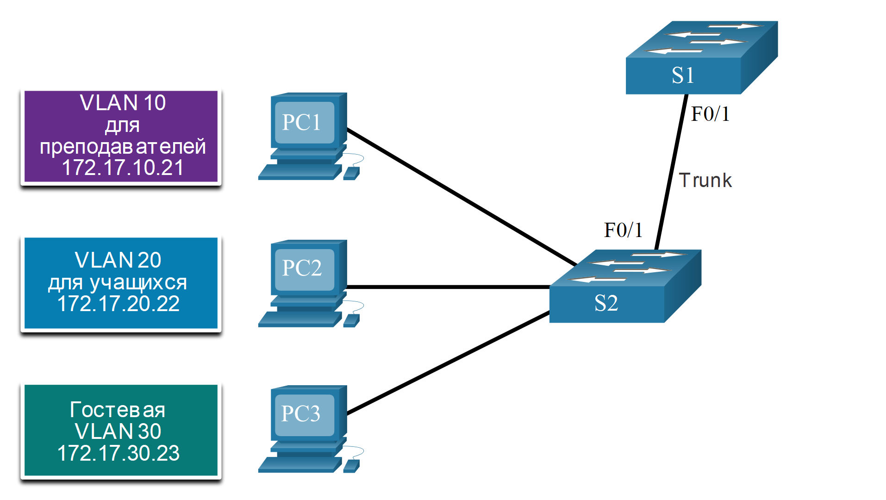

# Транки виртуальных сетей

<!-- 3.4.1 -->
## Команды конфигурации магистрального канала (транка)

Теперь, когда вы настроили и проверили VLAN, пришло время настроить и проверить транки VLAN. Транк VLAN — это канал уровня 2 между двумя коммутаторами, несущий трафик для всех VLAN (если разрешенный список VLAN не ограничен вручную или динамически).

Чтобы включить магистральные каналы, настройте соединительные порты с помощью набора команд конфигурации интерфейса, показанных в таблице.

| Задача | 	Команда IOS |
| --- | --- |
| Войдите в режим глобальной настройки. | Switch# **configure terminal** |
| Войдите в режим интерфейсной конфигурации. | Switch(config)# **interface** interface-id |
| Установите порт в режим постоянного транка. | Switch(config-if)# **switchport mode trunk** |
| Установите в качестве VLAN с нетегированным трафиком сеть, отличную от VLAN 1. | Switch(config-if)# **switchport trunk native vlan** vlan-id |
| Укажите список сетей VLAN, которым разрешен доступ в магистральный канал. | Switch(config-if)# **switchport trunk allowed vlan** vlan-list |
| Вернитесь в привилегированный исполнительский режим. | Switch(config-if)# **end** |

<!-- 3.4.2 -->
## Пример конфигурации магистрального канала

На риунке сети VLAN 10, 20 и 30 поддерживают компьютеры для инструкторов, учащихся и гостевой компьютер (PC1, PC2 и PC3). Порт F0/1 на коммутаторе S1 настроен в качестве транкового порта и пересылает трафик для сетей VLAN 10, 20 и 30. Сеть VLAN 99 настроена в качестве native VLAN.



К каждой VLAN относятся следующие подсети:
- VLAN 10 - Faculty/Staff - 172.17.10.0/24
- VLAN 20 - Students - 172.17.20.0/24
- VLAN 30 - Guests - 172.17.30.0/24
- VLAN 99 - Native - 172.17.99.0/24

В примере показана конфигурация порта F0/1 коммутатора S1 в качестве магистрального порта. Сеть VLAN с нетегированным трафиком изменена на VLAN 99, а список разрешенных сетей VLAN включает только сети 10, 20, 30 и 99.

```
S1(config)# interface fastEthernet 0/1
S1(config-if)# switchport mode trunk
S1(config-if)# switchport trunk native vlan 99
S1(config-if)# switchport trunk allowed vlan 10,20,30,99
S1(config-if)# end
```

**Примечание**: Эта конфигурация предполагает использование коммутаторов Cisco Catalyst 2960, которые автоматически используют инкапсуляцию 802.1Q на магистральных каналах. Для других коммутаторов может потребоваться ручная настройка инкапсуляции. Всегда настраивайте оба конца магистрального канала с одной и той же native VLAN. Если конфигурация магистрали 802.1Q не одинакова на обоих концах, ПО Cisco IOS сообщает об ошибках.

<!-- 3.4.3 -->
## Пример конфигурации магистрального канала

Выходной сигнал коммутатора отображает конфигурацию порта коммутатора F0/1 коммутатора S1. Конфигурация проверяется с помощью команды **show interfaces** interface-ID **switchport**.

```
S1# show interfaces fa0/1 switchport
Name: Fa0/1
Switchport: Enabled
Administrative Mode: trunk
Operational Mode: trunk
Administrative Trunking Encapsulation: dot1q
Operational Trunking Encapsulation: dot1q
Negotiation of Trunking: On
Access Mode VLAN: 1 (default)
Trunking Native Mode VLAN: 99 (VLAN0099)
Voice VLAN: none
Administrative private-vlan host-association: none 
Administrative private-vlan mapping: none 
Administrative private-vlan trunk native VLAN: none
Administrative private-vlan trunk encapsulation: dot1q
Administrative private-vlan trunk normal VLANs: none
Administrative private-vlan trunk associations: none
Administrative private-vlan trunk private VLANs: none 
Operational private-vlan: none
Trunking VLANs Enabled: 10,20,30,99
Pruning VLANs Enabled: 2-1001
(output omitted)
```

Верхняя подсвеченная область показывает, что порт F0/1 имеет административный режим **trunk**. Порт находится в режиме транкинга. Следующая подсвеченная область проверяет, является ли собственная VLAN 99. Далее вниз по выходным данным, нижняя подсвеченная область показывает, что VLAN 10, 20, 30 и 99 включены на магистрали.

<!-- 3.4.4 -->
## Сброс транка в состояние по умолчанию

Используйте команды **no switchport trunk allowed vlan** и **no switchport trunk native vlan** для удаления разрешенных VLAN и сброса собственной VLAN магистрали. При восстановлении состояния по умолчанию магистраль разрешает все VLAN и использует VLAN 1 в качестве собственной VLAN. В примере показаны команды, используемые для сброса всех характеристик транкинга интерфейса транкинга к настройкам по умолчанию.

```
S1(config)# interface fa0/1
S1(config-if)# no switchport trunk allowed vlan
S1(config-if)# no switchport trunk native vlan
S1(config-if)# end
```

```
The show interfaces f0/1 switchport command reveals that the trunk has been reconfigured to a default state.
```

```
S1# show interfaces fa0/1 switchport
Name: Fa0/1
Switchport: Enabled
Administrative Mode: trunk
Operational Mode: trunk
Administrative Trunking Encapsulation: dot1q
Operational Trunking Encapsulation: dot1q
Negotiation of Trunking: On
Access Mode VLAN: 1 (default) 
Trunking Native Mode VLAN: 1 (default)
Administrative Native VLAN tagging: enabled
Voice VLAN: none
Administrative private-vlan host-association: none 
Administrative private-vlan mapping: none 
Administrative private-vlan trunk native VLAN: none
Administrative private-vlan trunk Native VLAN tagging: enabled
Administrative private-vlan trunk encapsulation: dot1q
Administrative private-vlan trunk normal VLANs: none
Administrative private-vlan trunk associations: none
Administrative private-vlan trunk mappings: none
Operational private-vlan: none
Trunking VLANs Enabled: ALL
Pruning VLANs Enabled: 2-1001
(output omitted)
```

В этом примере выходных данных показаны команды, используемые для удаления функции магистрали из порта коммутатора F0/1 на коммутаторе S1. Команда **show interfaces f0/1 switchport** показывает, что интерфейс F0/1 теперь находится в статическом режиме доступа.

```
S1(config)# interface fa0/1
S1(config-if)# switchport mode access
S1(config-if)# end
S1# show interfaces fa0/1 switchport
Name: Fa0/1
Switchport: Enabled
Administrative Mode: static access
Operational Mode: static access
Administrative Trunking Encapsulation: dot1q
Operational Trunking Encapsulation: native
Negotiation of Trunking: Off
Access Mode VLAN: 1 (default)
Trunking Native Mode VLAN: 1 (default)
Administrative Native VLAN tagging: enabled
(output omitted)
```

<!-- 3.4.5 -->
## Packet Tracer. Настройка магистральных каналов

В этом упражнении Packet Tracer вам нужно:

Проверка сетей VLAN
Настройка магистральных каналов

[Настройка магистральных каналов - PDF](./assets/3.4.5-packet-tracer---configure-trunks_ru-RU.pdf)

[Настройка магистральных каналов - PKA](./assets/3.4.5-packet-tracer---configure-trunks_ru-RU.pka)

<!-- 3.4.6 -->
## Лабораторная работа. Настройка VLAN и магистральных каналов

В этом упражнении Packet Tracer вам нужно:

- Создание сети и настройка основных параметров устройства
- Создание сетей VLAN и назначение портов коммутатора
- Поддержка назначения портов VLAN и базы данных VLAN
- Конфигурация магистрального канала стандарта 802.1Q между коммутаторами
- Удаление базы данных VLAN

[Конфигурация VLAN и транкинга — Режим симуляции физического оборудования - PDF](./assets/3.4.6-packet-tracer---configure-vlans-and-trunking---physical-mode_ru-RU.pdf)

[Конфигурация VLAN и транкинга — Режим симуляции физического оборудования - PKA](./assets/3.4.6-packet-tracer---configure-vlans-and-trunking---physical-mode_ru-RU.pka)

**Лабораторное оборудование**

[Настройка VLAN и магистральных каналов - PDF](./assets/3.4.6-lab---configure-vlans-and-trunking_ru-RU.pdf)