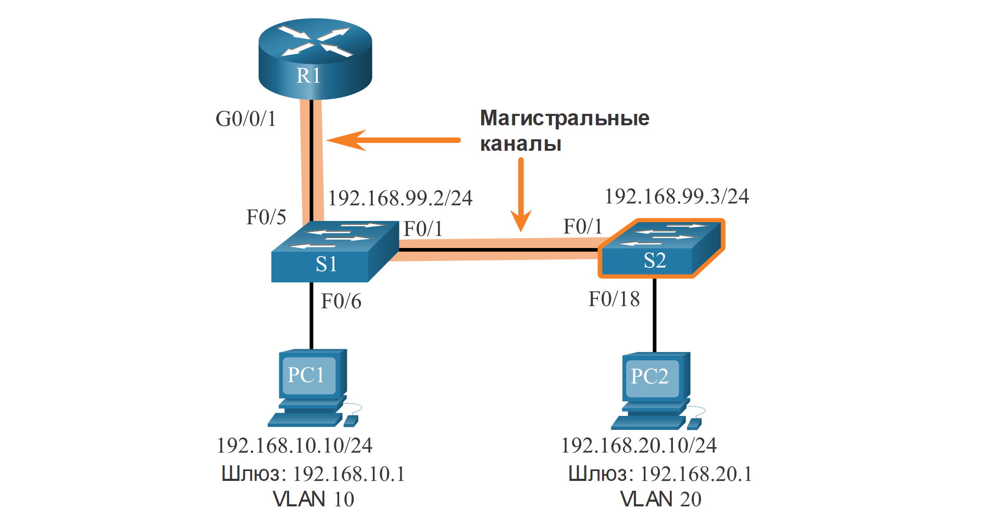
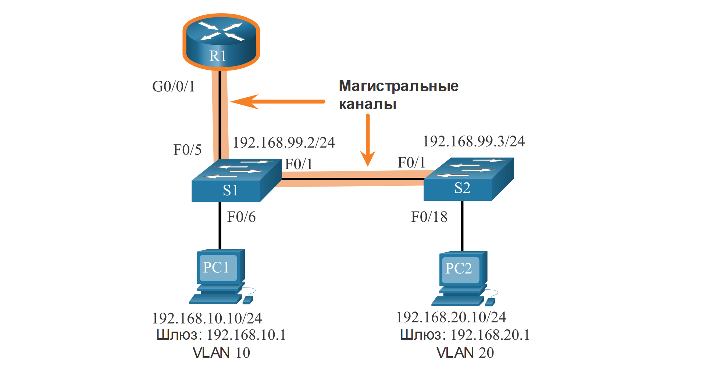

<!-- 4.2.1 -->
## Конфигурация ROS (Router-on-a-stick)

В предыдущем разделе были перечислены три различных способа создания маршрутизации между VLAN, а также подробно описана устаревшая маршрутизация между VLAN. В этом разделе подробно описано, как настроить маршрутизацию между виртуальными локальными сетями на маршрутизаторе. Вы можете видеть на рисунке, что маршрутизатор не находится в центре топологии, а вместо этого, кажется, находится на палке рядом с границей, отсюда и название.

На рисунке интерфейс R1 GigabitEthernet 0/0/1 подключен к порту S1 FastEthernet 0/5. Порт S1 FastEthernet 0/1 подключен к порту S2 FastEthernet 0/1. Это магистральные каналы, которые необходимы для пересылки трафика внутри VLAN и между ними.


<!-- /courses/srwe-dl/af9ece90-34fe-11eb-b1b2-9b1b0c1f7e0d/afb60018-34fe-11eb-b1b2-9b1b0c1f7e0d/assets/c9b3af82-1c27-11ea-af09-3b2e6521927c.svg -->

Для маршрутизации между VLAN интерфейс R1 GigabitEthernet 0/0/1 логически разделен на три подинтерфейса, как показано в таблице. В таблице также показаны три VLAN, которые будут настроены на коммутаторах.

**Router R1 Subinterfaces**

| **Подинтерфейс** | **VLAN** | **IP-адрес** |
| --- | --- | --- |
| G0/0/1.10 | 10 | 192.168.10.1/24 |
| G0/0/1.20 | 20 | 192.168.20.1/24 |
| G0/0/1.99 | 99 | 192.168.99.1/24 |

Предположим, что R1, S1 и S2 имеют начальные базовые конфигурации. В настоящее время PC1 и PC2 не могут **ping** друг друга, поскольку они находятся в отдельных сетях. Только S1 и S2 могут **ping** друг друга, но они, но не доступны PC1 или PC2, потому что они также в разных сетях.

Чтобы устройства могли выполнять эхо-запрос друг с другом, коммутаторы должны быть настроены с помощью VLAN и магистрали, а маршрутизатор должен быть настроен для маршрутизации между VLAN.

<!-- 4.2.2 -->
## Сети VLAN и конфигурация магистральных каналов

Выполните следующие шаги для настройки VLAN и магистральных каналов на S1:

**Шаг 1**. Создайте сети VLAN на коммутаторе S1 и присвойте им имена.

**Шаг 2**. Создайте интерфейс управления.

**Шаг 3**. Настройка портов доступа

**Шаг 4**. Настройте транковые порты.


<!-- /courses/srwe-dl/af9ece90-34fe-11eb-b1b2-9b1b0c1f7e0d/afb60018-34fe-11eb-b1b2-9b1b0c1f7e0d/assets/c9b472d1-1c27-11ea-af09-3b2e6521927c.svg -->

**1. Создайте сети VLAN и присвойте им имена.**

Во-первых, создайте и назовите VLAN. VLAN создаются только после выхода из режима подконфигурации VLAN.

```
S1(config)# vlan 10
S1(config-vlan)# name LAN10
S1(config-vlan)# exit
S1(config)# vlan 20
S1(config-vlan)# name LAN20
S1(config-vlan)# exit
S1(config)# vlan 99
S1(config-vlan)# name Management
S1(config-vlan)# exit
S1(config)#
```

**2. Создайте интерфейс управления.**

Затем создайте интерфейс управления VLAN 99 вместе со шлюзом по умолчанию R1.

```
S1(config)# interface vlan 99
S1(config-if)# ip add 192.168.99.2 255.255.255.0
S1(config-if)# no shut
S1(config-if)# exit
S1(config)# ip default-gateway 192.168.99.1
S1(config)#
```

**3. Настройка портов доступа.**

Затем порт Fa0/6, подключающийся к PC1, настраивается в качестве порта доступа в VLAN 10. Предположим, что PC1 настроен с правильным IP-адресом и шлюзом по умолчанию.

```
S1(config)# interface fa0/6
S1(config-if)# switchport mode access
S1(config-if)# switchport access vlan 10
S1(config-if)# no shut
S1(config-if)# exit
S1(config)#
```

**4. Настройте транковые порты.**

Наконец, порты Fa0/1, подключающиеся к S2, и Fa05, подключающиеся к R1, настроены в качестве магистральных портов.

```
S1(config)# interface fa0/1
S1(config-if)# switchport mode trunk
S1(config-if)# no shut
S1(config-if)# exit
S1(config)# interface fa0/5
S1(config-if)# switchport mode trunk
S1(config-if)# no shut
S1(config-if)# end
*Mar 1 00:23:43.093: %LINEPROTO-5-UPDOWN: Line protocol on Interface FastEthernet0/1, changed state to up
*Mar 1 00:23:44.511: %LINEPROTO-5-UPDOWN: Line protocol on Interface FastEthernet0/5, changed state to up
```

<!-- 4.2.3 -->
## S2 Сети VLAN и конфигурации магистральных каналов

Конфигурация S2 аналогична конфигурации S1.


<!-- /courses/srwe-dl/af9ece90-34fe-11eb-b1b2-9b1b0c1f7e0d/afb60018-34fe-11eb-b1b2-9b1b0c1f7e0d/assets/c9b5f971-1c27-11ea-af09-3b2e6521927c.svg -->

```
S2(config)# vlan 10
S2(config-vlan)# name LAN10
S2(config-vlan)# exit
S2(config)# vlan 20
S2(config-vlan)# name LAN20
S2(config-vlan)# exit
S2(config)# vlan 99
S2(config-vlan)# name Management
S2(config-vlan)# exit
S2(config)#
S2(config)# interface vlan 99
S2(config-if)# ip add 192.168.99.3 255.255.255.0
S2(config-if)# no shut
S2(config-if)# exit
S2(config)# ip default-gateway 192.168.99.1
S2(config)# interface fa0/18
S2(config-if)# switchport mode access
S2(config-if)# switchport access vlan 20
S2(config-if)# no shut
S2(config-if)# exit
S2(config)# interface fa0/1
S2(config-if)# switchport mode trunk
S2(config-if)# no shut
S2(config-if)# exit
S2(config-if)# end
*Mar  1 00:23:52.137: %LINEPROTO-5-UPDOWN: Line protocol on Interface FastEthernet0/1, changed state to up
```

<!-- 4.2.4 -->
## R1 Конфигурация подинтерфейса

Для использования метода Router-on-a-Stick требуется настроить подинтерфейсы для каждой маршрутизируемой сети VLAN.

Подинтерфейс создается с помощью команды режима глобальной конфигурации **interface** _interface_id subinterface_id_. Синтаксис для подинтерфейсов следующий: сначала указывается физический интерфейс, в данном случае g0/0, затем точка и номер подинтерфейса. Хотя это не требуется, обычно сопоставляют номер подинтерфейса с номером VLAN.

Затем каждый подинтерфейс настраивается с помощью следующих двух команд:

* **encapsulation dot1q** _vlan\_id_ **\[native\]** \- This command configures the subinterface to respond to 802.1Q encapsulated traffic from the specified _vlan-id_. The **native**  ключевого слова добавляется только для установки собственной VLAN отличной от VLAN 1.
* **ip address** _ip-address subnet-mask_ - Эта команда настраивает IPv4-адрес подинтерфейса. Этот адрес обычно служит шлюзом по умолчанию для данной VLAN.

Повторите процесс для каждой маршрутизируемой VLAN. Для осуществления маршрутизации каждому подынтерфейсу маршрутизатора необходимо назначить IP-адрес в своей подсети.

После создания всех подинтерфейсов включите физический интерфейс с помощью команды конфигурации **no shutdown** интерфейса. Если отключить физический интерфейс, то все подчиненные интерфейсы также отключаются.

В следующей конфигурации субинтерфейсы R1 G0/0/1 настроены для VLAN 10, 20 и 99.


<!-- /courses/srwe-dl/af9ece90-34fe-11eb-b1b2-9b1b0c1f7e0d/afb60018-34fe-11eb-b1b2-9b1b0c1f7e0d/assets/c9b695b0-1c27-11ea-af09-3b2e6521927c.svg -->

```
R1(config)# interface G0/0/1.10
R1(config-subif)# description Default Gateway for VLAN 10
R1(config-subif)# encapsulation dot1Q 10
R1(config-subif)# ip add 192.168.10.1 255.255.255.0
R1(config-subif)# exit
R1(config)#
R1(config)# interface G0/0/1.20
R1(config-subif)# description Default Gateway for VLAN 20
R1(config-subif)# encapsulation dot1Q 20
R1(config-subif)# ip add 192.168.20.1 255.255.255.0
R1(config-subif)# exit
R1(config)#
R1(config)# interface G0/0/1.99
R1(config-subif)# description Default Gateway for VLAN 99
R1(config-subif)# encapsulation dot1Q 99
R1(config-subif)# ip add 192.168.99.1 255.255.255.0
R1(config-subif)# exit
R1(config)#
R1(config)# interface G0/0/1
R1(config-if)# description Trunk link to S1
R1(config-if)# no shut
R1(config-if)# end
R1#
*Sep 15 19:08:47.015: %LINK-3-UPDOWN: Interface GigabitEthernet0/0/1, changed state to down
*Sep 15 19:08:50.071: %LINK-3-UPDOWN: Interface GigabitEthernet0/0/1, changed state to up
*Sep 15 19:08:51.071: %LINEPROTO-5-UPDOWN: Line protocol on Interface GigabitEthernet0/0/1, changed state to up
R1#
```

<!-- 4.2.5 -->
## Проверка подключения между PC1 и PC2

Конфигурация маршрутизатора на палке завершается после настройки магистрали коммутатора и подинтерфейсов маршрутизатора. Конфигурацию можно проверить на хостах, маршрутизаторе и коммутаторе.

С узла проверьте подключение к узлу в другой VLAN с помощью **ping** команды. Лучше сначала проверить текущую конфигурацию IP хоста с помощью команды хоста **ipconfig** Windows.

```
C:\Users\PC1> ipconfig
Windows IP Configuration
Ethernet adapter Ethernet0:
  Connection-specific DNS Suffix . :
  Link-local IPv6 Address          : fe80::5c43:ee7c:2959:da68%6
  IPv4 Address                     : 192.168.10.10
  Subnet Mask                      : 255.255.255.0
  Default Gateway                  : 192.168.10.1
C:\Users\PC1> 
```

Выходные данные подтверждают адрес IPv4 и шлюз по умолчанию PC1. Затем используйте **ping** для проверки соединения с PC2 и S1, как показано на рисунке. **ping** Выходные данные успешно подтверждают работу маршрутизации между VLAN.

```
C:\Users\PC1> ping 192.168.20.10
Pinging 192.168.20.10 with 32 bytes of data:
Reply from 192.168.20.10: bytes=32 time<1ms TTL=127 
Reply from 192.168.20.10: bytes=32 time<1ms TTL=127
Reply from 192.168.20.10: bytes=32 time<1ms TTL=127
Reply from 192.168.20.10: bytes=32 time<1ms TTL=127
Ping statistics for 192.168.20.10:
    Packets: Sent = 4, Received = 4, Lost = 0 (0% loss).
Approximate round trip times in milli-seconds:
    Minimum = 0ms, Maximum = 0ms, Average = 0ms
C:\Users\PC1> 
C:\Users\PC1> ping 192.168.99.2
Pinging 192.168.99.2 with 32 bytes of data:
Request timed out.
Request timed out.
Reply from 192.168.99.2: bytes=32 time=2ms TTL=254
Reply from 192.168.99.2: bytes=32 time=1ms TTL=254	|
Ping statistics for 192.168.99.2:
    Packets: Sent = 4, Received = 2, Lost = 2 (50% loss). 
Approximate round trip times in milli-seconds:
    Minimum = 1ms, Maximum = 2ms, Average = 1ms
C:\Users\PC1> 
```

<!-- 4.2.6 -->
## Проверка маршрутизации между сетями VLAN с использованием метода Router-on-a-Stick

Помимо использования **ping** между устройствами, следующие **show** команды могут использоваться для проверки и устранения неполадок конфигурации маршрутизатора на палке.

**show ip route**

Убедитесь, что подинтерфейсы отображаются в таблице маршрутизации R1 с помощью команды **show ip route**. Обратите внимание, что для каждой маршрутизируемой VLAN существует три подключенных маршрута (C) и соответствующие интерфейсы выхода. Вывод подтверждает, что правильные подсети, VLAN и подынтерфейсы активны.

```
R1# show ip route | begin Gateway
Gateway of last resort is not set
      192.168.10.0/24 is variably subnetted, 2 subnets, 2 masks
C 192.168.10.0/24 is directly connected, GigabitEthernet0/0/1.10
L 192.168.10.1/32 is directly connected, GigabitEthernet0/0/1.10 
      192.168.20.0/24 is variably subnetted, 2 subnets, 2 masks
C 192.168.20.0/24 is directly connected, GigabitEthernet0/0/1.20 
L 192.168.20.1/32 is directly connected, GigabitEthernet0/0/1.20 
      192.168.99.0/24 is variably subnetted, 2 subnets, 2 masks 
C 192.168.99.0/24 is directly connected, GigabitEthernet0/0/1.99 
L 192.168.99.1/32 is directly connected, GigabitEthernet0/0/1.99
R1# 
```

**show ip interface brief**

Другая полезная команда маршрутизатора **show ip interface brief**, как показано на выходных данных. Выходные данные подтверждают, что подинтерфейсы имеют правильный IPv4 адреса и что они работают.

```
R1# show ip interface brief | include up 
GigabitEthernet0/0/1 unassigned YES unset up up 
Gi0/0/1.10 192.168.10.1 YES manual up up 
Gi0/0/1.20 192.168.20.1 YES manual up up
Gi0/0/1.99 192.168.99.1 YES manual up up
R1#
```

**show interfaces**

Подинтерфейсы можно проверить с помощью команды **show interfaces** _subinterface-id_, как показано на рисунке.

```
R1# show interfaces g0/0/1.10 
GigabitEthernet0/0/1.10 is up, line protocol is up 
  Hardware is ISR4221-2x1GE, address is 10b3.d605.0301 (bia 10b3.d605.0301)
  Description Default Gateway for VLAN 10
  Internet address is 192.168.10.1/24
  MTU 1500 bytes, BW 100000 Kbit/sec, DLY 100 usec,
     reliability 255/255, txload 1/255, rxload 1/255
  Hardware is ISR4221-2x1GE, address is 10b3.d605.0301 (bia 10b3.d605.0301)
  ARP type: ARPA, ARP Timeout 04:00:00
  Keepalive not supported
  Last clearing of show interface counters never
R1#
```

**show interfaces trunk**

Неправильная конфигурация также может быть на порту магистрального коммутатора. Поэтому также полезно проверить активные магистральные каналы на коммутаторе уровня 2 с помощью команды **show interfaces trunk**, как показано в выходных данных. Выходные данные подтверждают, что канал до R1 является магистральным для необходимых VLAN.

**Примечание:** Хотя VLAN 1 не была настроена явно, она была включена автоматически, так как управляемый трафик магистральных каналов всегда будет перенаправляться на VLAN 1.

```
S1# show interfaces trunk 
Port Mode Encapsulation Status Native vlan
Fa0/1 on 802.1q trunking 1
Fa0/5 on 802.1q trunking 1
Port Vlans allowed on trunk
Fa0/1 1-4094
Fa0/5 1-4094
Port Vlans allowed and active in management domain
Fa0/1 1,10,20,99
Fa0/5 1,10,20,99
Port Vlans in spanning tree forwarding state and not pruned
Fa0/1 1,10,20,99
Fa0/5 1,10,20,99
S1#
```

<!-- 4.2.7 -->
## Работа в симуляторе: настройка маршрутизации между сетями VLAN с использованием конфигурации router-on-a-stick

В этом задании необходимо сначала проверить подключение, прежде чем приступить к реализации маршрутизации между VLAN. Затем необходимо настроить сети VLAN и маршрутизацию между VLAN. В завершение необходимо активировать магистральный канал и проверить подключение между сетями VLAN.

[Настройка маршрутизации между виртуальными локальными сетями на базе конфигурации router-on-a-stick (pdf)](./assets/4.2.7-packet-tracer---configure-router-on-a-stick-inter-vlan-routing_ru-RU.pdf)

[Настройка маршрутизации между сетями VLAN с использованием конфигурации router-on-a-stick (pka)](./assets/4.2.7-packet-tracer---configure-router-on-a-stick-inter-vlan-routing_ru-RU.pka)

<!-- 4.2.8 -->
## Работа в симуляторе: настройка маршрутизации между VLAN с использованием конфигурации router-on-a-stick

В этой лабораторной работе вы выполните следующие задачи.
*  Часть 1: Создание сети и настройка основных параметров устройства
*  Часть 2: Настройте коммутаторы для работы с сетями VLAN и создания магистральных каналов
*  Часть 3: Конфигурация маршрутизации между сетями VLAN на основе транкового канала

[Настройка маршрутизации между сетями VLAN с использованием конфигурации router-on-a-stick (lab)](./assets/4.2.8-lab---configure-router-on-a-stick-inter-vlan-routing_ru-RU.pdf)

