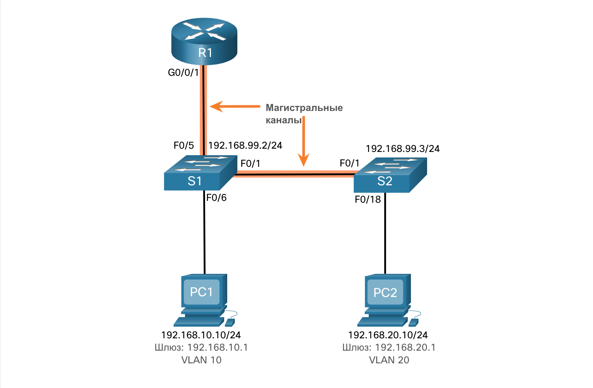

<!-- 4.4.1 -->
## Общие проблемы с маршрутизацией между VLAN

Теперь вы знаете, что при настройке и проверке необходимо также иметь возможность устранять неполадки. В этом разделе рассматриваются некоторые распространенные проблемы сети, связанные с маршрутизацией между VLAN.

Существует ряд причин, по которым конфигурация маршрутизации между VAN может не работать. Все они связаны с проблемами подключения. Сначала проверьте физический уровень, чтобы устранить любые проблемы, при которых кабель может быть подключен к неправильному порту. Если подключения верны, используйте список в таблице по другим общим причинам, по которым может произойти сбой подключения между VLAN.

| **Тип проблемы** | **Как исправить** | **Как проверить** |
| --- | --- | --- |
| Отсутствующие сети VLAN | <ul><li>Создайте (или повторно создайте) VLAN, если она не существует.</li><li>Убедитесь, что порт хоста назначен правильной VLAN.</li></ul> | `show vlan [brief]`<br>`show interfaces switchport`<br>`ping` |
| Проблемы магистрального порта коммутатора | <ul><li>Убедитесь, что магистральные соединения настроены правильно.</li><li>Убедитесь, что порт является магистральным портом и включен.</li></ul> | `show interfaces trunk`<br>`show running-config` |
| Неполадки в работе порта коммутатора | <ul><li>Назначьте порт соответствующей сети VLAN. </li><li>Убедитесь, что порт является портом доступа и включен.</li><li>Неправильно настроен узел в неправильной подсети.</li></ul> | `show interfaces switchport`<br>`show running-config interface`<br>`ipconfig` |
| Неполадки в настройках маршрутизатора | <ul><li>IPv4-адрес подинтерфейса маршрутизатора настроен неправильно.</li><li>Подинтерфейс маршрутизатора назначается с идентификатором VLAN.</li></ul> | `show ip interface brief`<br>`show interfaces` |

<!-- 4.4.2 -->
## Сценарий устранение неполадок маршрутизации между VLAN

Примеры некоторых из этих проблем маршрутизации между VLAN теперь будут рассмотрены более подробно.

Эта топология будет использоваться для всех этих проблем.


<!-- /courses/srwe-dl/af9ece90-34fe-11eb-b1b2-9b1b0c1f7e0d/afb62722-34fe-11eb-b1b2-9b1b0c1f7e0d/assets/c9bfbd70-1c27-11ea-af09-3b2e6521927c.svg -->

Информация об адресации VLAN и IPv4 для R1 приведена в таблице.

**Router R1 Subinterfaces**

| **Подинтерфейс** | **VLAN** | **IP-адрес** |
| --- | --- | --- |
| G0/0/0.10 | 10 | 192.168.10.1/24 |
| G0/0/0.20 | 20 | 192.168.20.1/24 |
| G0/0/0.30 | 99 | 192.168.99.1/24 |

<!-- 4.4.3 -->
## Отсутствующие сети VLAN

Проблема подключения между VLAN может быть вызвана отсутствием VLAN. VLAN может отсутствовать, если она не была создана, случайно удалена или не разрешена на магистрального канала.

Например, PC1 в настоящее время подключен к VLAN 10, как показано в выходных данных **show vlan brief** команды.

```
S1# show vlan brief
VLAN Name                             Status    Ports
---- -------------------------------- --------- -------------------------------
1    default                          active    Fa0/2, Fa0/3, Fa0/4, Fa0/7
                                                Fa0/8, Fa0/9, Fa0/10, Fa0/11
                                                Fa0/12, Fa0/13, Fa0/14, Fa0/15
                                                Fa0/16, Fa0/17, Fa0/18, Fa0/19
                                                Fa0/20, Fa0/21, Fa0/22, Fa0/23
                                                Fa0/24, Gi0/1, Gi0/2
10   LAN10                            active    Fa0/6
20   LAN20                            active
99   Management                       active
1002 fddi-default                     act/unsup
1003 token-ring-default               act/unsup
1004 fddinet-default                  act/unsup
1005 trnet-default                    act/unsup
S1#
```

Теперь предположим, что VLAN 10 случайно удаляется, как показано в следующем выводе.

```
S1(config)# no vlan 10
S1(config)# do show vlan brief
VLAN Name                             Status    Ports
---- -------------------------------- --------- -------------------------------
1    default                          active    Fa0/2, Fa0/3, Fa0/4, Fa0/7
                                                Fa0/8, Fa0/9, Fa0/10, Fa0/11
                                                Fa0/12, Fa0/13, Fa0/14, Fa0/15
                                                Fa0/16, Fa0/17, Fa0/18, Fa0/19
                                                Fa0/20, Fa0/21, Fa0/22, Fa0/23
                                                Fa0/24, Gi0/1, Gi0/2
20   LAN20                            active
99   Management                       active
1002 fddi-default                     act/unsup
1003 token-ring-default               act/unsup
1004 fddinet-default                  act/unsup
1005 trnet-default                    act/unsup
S1(config)#
```

Обратите внимание, что VLAN 10 теперь отсутствует в выходных данных. Также обратите внимание, что порт Fa0/6 не был переназначен во VLAN по умолчанию. При удалении сети VLAN все порты, назначенные этой сети, становятся неактивными. Они остаются связанными с этой сетью VLAN (и, следовательно, неактивными), пока не будут назначены новой сети VLAN.

Используйте команду **show interface** _interface-id_ **switchport** для проверки членства в VLAN.

```
S1(config)# do show interface fa0/6 switchport
Name: Fa0/6
Switchport: Enabled
Administrative Mode: static access
Operational Mode: static access
Administrative Trunking Encapsulation: dot1q
Operational Trunking Encapsulation: native
Negotiation of Trunking: Off
Access Mode VLAN: 10 (Inactive)
Trunking Native Mode VLAN: 1 (default)
Administrative Native VLAN tagging: enabled
Voice VLAN: none
(Output omitted)
```

Повторное создание отсутствующей VLAN автоматически переназначает хосты в нее, как показано в следующих выходных данных.

```
S1(config)# vlan 10
S1(config-vlan)# do show vlan brief
VLAN Name                             Status    Ports
---- -------------------------------- --------- -------------------------------
1    default                          active    Fa0/2, Fa0/3, Fa0/4, Fa0/7
                                                Fa0/8, Fa0/9, Fa0/10, Fa0/11
                                                Fa0/12, Fa0/13, Fa0/14, Fa0/15
                                                Fa0/16, Fa0/17, Fa0/18, Fa0/19
                                                Fa0/20, Fa0/21, Fa0/22, Fa0/23
                                                Fa0/24, Gi0/1, Gi0/2
20   LAN20                            active
99   Management                       active
1002 fddi-default                     act/unsup
1003 token-ring-default               act/unsup
1004 fddinet-default                  act/unsup
1005 trnet-default                    act/unsup
S1(config-vlan)#
```

Обратите внимание, что VLAN не была создана должным образом. Причина заключается в том, что для создания VLAN необходимо выйти из режима подконфигурации VLAN, как показано в следующих выходных данных.

```
S1(config-vlan)# exit
S1(config)# vlan 10
S1(config)# do show vlan brief
VLAN Name                             Status    Ports
---- -------------------------------- --------- -------------------------------
1    default                          active    Fa0/2, Fa0/3, Fa0/4, Fa0/7
                                                Fa0/8, Fa0/9, Fa0/10, Fa0/11
                                                Fa0/12, Fa0/13, Fa0/14, Fa0/15
                                                Fa0/16, Fa0/17, Fa0/18, Fa0/19
                                                Fa0/20, Fa0/21, Fa0/22, Fa0/23
                                                Fa0/24, Gi0/1, Gi0/2
10   VLAN0010                         active    Fa0/6
20   LAN20                            active
99   Management                       active
1002 fddi-default                     act/unsup
1003 token-ring-default               act/unsup
1004 fddinet-default                  act/unsup
1005 trnet-default                    act/unsup
S1(config)#
```

Теперь обратите внимание, что VLAN включена в список и что хост, подключенный к Fa0/6, находится на VLAN 10.

<!-- 4.4.4 -->
## Проблемы магистрального порта коммутатора

Другая проблема маршрутизации между VLAN связана с неправильной конфигурацией портов коммутатора. В устаревшем решении маршрутизации между VLAN это может быть вызвано, когда порт доступа маршрутизатора не назначен правильной VLAN.

Однако при решении ROS наиболее распространенной причиной является неправильная настройка магистрального порта.

Например, предположим, что до недавнего времени PC1 мог подключаться к узлам в других VLAN. Краткий обзор журналов обслуживания показал, что коммутатор S1 уровня 2 был недавно доступен для текущего обслуживания. Таким образом вы подозреваете, что проблема может быть связана с этим коммутатором.


<!-- /courses/srwe-dl/af9ece90-34fe-11eb-b1b2-9b1b0c1f7e0d/afb62722-34fe-11eb-b1b2-9b1b0c1f7e0d/assets/c9c14412-1c27-11ea-af09-3b2e6521927c.svg -->

На S1 убедитесь, что порт, подключаемый к R1 (например, F0/5), правильно настроен в качестве магистрального канала с помощью  команды **show interfaces trunk**, как показано на рисунке.

```
S1# show interfaces trunk
Port        Mode             Encapsulation  Status        Native vlan
Fa0/1       on               802.1q         trunking      1
Port        Vlans allowed on trunk
Fa0/1       1-4094
Port        Vlans allowed and active in management domain
Fa0/1       1,10,20,99
Port        Vlans in spanning tree forwarding state and not pruned
Fa0/1       1,10,20,99
S1#
```

Порт Fa0/5, подключающийся к R1, таинственно отсутствует на выходе. Проверьте конфигурацию интерфейса с помощью команды **show running-config interface fa0/5**, как показано на рисунке.

```
S1# show running-config | include interface fa0/5
Building configuration...
Current configuration : 96 bytes
!
interface FastEthernet0/5
 description Trunk link to R1
 switchport mode trunk
 shutdown
end
S1#
```

Как вы можете видеть, порт был случайно отключен. Чтобы устранить проблему, повторно включите порт и проверьте состояние транка, как показано на выходных данных.

```
S1(config)# interface fa0/5
S1(config-if)# no shut
S1(config-if)#
*Mar  1 04:46:44.153: %LINK-3-UPDOWN: Interface FastEthernet0/5, changed state to up
S1(config-if)#
*Mar  1 04:46:47.962: %LINEPROTO-5-UPDOWN: Line protocol on Interface FastEthernet0/5, changed state to up
S1(config-if)# do show interface trunk
Port        Mode             Encapsulation  Status        Native vlan
Fa0/1       on               802.1q         trunking      1
Fa0/5       on               802.1q         trunking      1
Port        Vlans allowed on trunk
Fa0/1       1-4094
Fa0/5       1-4094
Port        Vlans allowed and active in management domain
Fa0/1       1,10,20,99
Fa0/5       1,10,20,99
Port        Vlans in spanning tree forwarding state and not pruned
Fa0/1       1,10,20,99
Fa0/1       1,10,20,99
S1(config-if)#
```

Чтобы уменьшить риск того, что нарушение канала связи между коммутаторами нарушит и маршрутизацию между сетями VLAN, в проекте сети должны быть предусмотрены резервные каналы связи и альтернативные пути маршрутизации.

<!-- 4.4.5 -->
## Неполадки в работе порта коммутатора

В настройках коммутатора могут присутствовать проблемы, поэтому рекомендуется использовать специальные команды для проверки конфигурации и определения неполадок.

Предположим, PC1 имеет правильный IPv4 адрес и шлюз по умолчанию, но не может использовать **ping** до собственного шлюза по умолчанию. PC1 должен быть подключен к порту VLAN 10.


<!-- /courses/srwe-dl/af9ece90-34fe-11eb-b1b2-9b1b0c1f7e0d/afb62722-34fe-11eb-b1b2-9b1b0c1f7e0d/assets/c9c22e70-1c27-11ea-af09-3b2e6521927c.svg -->

Проверьте конфигурацию порта на S1 с помощью команды **show interfaces** _interface-id_ **switchport**.

```
S1# show interface fa0/6 switchport
Name: Fa0/6
Switchport: Enabled
Administrative Mode: static access
Operational Mode: static access
Administrative Trunking Encapsulation: dot1q
Operational Trunking Encapsulation: native
Negotiation of Trunking: Off
Access Mode VLAN: 1 (default)
Trunking Native Mode VLAN: 1 (default)
Administrative Native VLAN tagging: enabled
Voice VLAN: none
```

Порт Fa0/6 настроен как порт доступа, как указано в выводе «статический доступ». (“static access”) Тем не менее, похоже, что он не был настроен для работы во VLAN 10. Проверьте настройку интерфейса:

```
S1# show running-config interface fa0/6
Building configuration...
Current configuration : 87 bytes
!
interface FastEthernet0/6
 description PC-A access port
 switchport mode access
end
S1#
```

Назначьте порт Fa0/6 во VLAN 10 и проверьте назначение порта.

```
S1# configure terminal
S1(config)# interface fa0/6
S1(config-if)# switchport access vlan 10
S1(config-if)# 
S1(config-if)# do show interface fa0/6 switchport
Name: Fa0/6
Switchport: Enabled
Administrative Mode: static access
Operational Mode: static access
Administrative Trunking Encapsulation: dot1q
Operational Trunking Encapsulation: native
Negotiation of Trunking: Off
Access Mode VLAN: 10 (VLAN0010)
Trunking Native Mode VLAN: 1 (default)
Administrative Native VLAN tagging: enabled
Voice VLAN: none
(Output omitted)
```

PC1 теперь может взаимодействовать с хостами в других VLAN.

<!-- 4.4.6 -->
## Неполадки в настройках маршрутизатора

Проблемы конфигурации маршрутизатора ROS обычно связаны с неправильными конфигурациями подинтерфейса. Например, был настроен неверный IP-адрес или неправильный идентификатор VLAN был присвоен подинтерфейсу.

Например, R1 должен предоставлять маршрутизацию между VLAN для пользователей в VLAN 10, 20 и 99. Однако пользователи VLAN 10 не могут связаться с любой другой VLAN.


<!-- /courses/srwe-dl/af9ece90-34fe-11eb-b1b2-9b1b0c1f7e0d/afb62722-34fe-11eb-b1b2-9b1b0c1f7e0d/assets/c9c2f1c2-1c27-11ea-af09-3b2e6521927c.svg -->

Вы проверили магистральный канал коммутатора и все выглядит в порядке. Проверьте состояние подинтерфейса с помощью команды **show ip interface brief**.

```
R1# show ip interface brief
Interface              IP-Address      OK? Method Status                Protocol
GigabitEthernet0/0/0   unassigned      YES unset  administratively down down
GigabitEthernet0/0/1   unassigned      YES unset  up                    up
Gi0/0/1.10             192.168.10.1    YES manual up                    up
Gi0/0/1.20             192.168.20.1    YES manual up                    up
Gi0/0/1.99             192.168.99.1    YES manual up                    up
Serial0/1/0            unassigned      YES unset  administratively down down
Serial0/1/1            unassigned      YES unset  administratively down down
R1#
```

Подинтерфейсам были назначены правильные адреса IPv4, и они работают.

Проверьте, какие VLAN включен каждый из подинтерфейсов. Для этого полезна команда **show interfaces**, но она генерирует много дополнительных выходных данных. Вывод команды можно уменьшить с помощью фильтров команд IOS, как показано на выходных данных.

```
R1# show interfaces | include Gig|802.1Q
GigabitEthernet0/0/0 is administratively down, line protocol is down
GigabitEthernet0/0/1 is up, line protocol is up
  Encapsulation 802.1Q Virtual LAN, Vlan ID  1., loopback not set
GigabitEthernet0/0/1.10 is up, line protocol is up
  Encapsulation 802.1Q Virtual LAN, Vlan ID  100.
GigabitEthernet0/0/1.20 is up, line protocol is up
  Encapsulation 802.1Q Virtual LAN, Vlan ID  20.
GigabitEthernet0/0/1.99 is up, line protocol is up
  Encapsulation 802.1Q Virtual LAN, Vlan ID  99.
R1#
```

Символ (|) вместе с некоторыми ключевыми словами select является полезным методом для вывода команды фильтрации. В этом примере ключевое слово **include** было использовано для идентификации того, что будут отображаться только строки, содержащие буквы «Gig» или «802.1Q». Из-за того, как **show interface** выходные данные перечислены естественным образом, с помощью этих фильтров создается сжатый список интерфейсов и назначенных им VLAN.

Обратите внимание, что интерфейс G0/0/1.10 неправильно назначен VLAN 100 вместо VLAN 10. Это подтверждается при просмотре конфигурации подинтерфейса R1 GigabitEthernet 0/0/1.10, как показано на рисунке.

```
R1# show running-config interface g0/0/1.10
Building configuration...
Current configuration : 146 bytes
!
interface GigabitEthernet0/0/1.10
 description Default Gateway for VLAN 10
 encapsulation dot1Q 100
 ip address 192.168.10.1 255.255.255.0
end
R1#
```

Чтобы исправить эту проблему, настройте подчиненный интерфейс G0/0.10 на правильную сеть VLAN с помощью команды режима глобальной конфигурации поднтерфейса **encapsulation dot1q 10**.

```
R1# conf t
Enter configuration commands, one per line.  End with CNTL/Z.
R1(config)# interface gigabitEthernet 0/0/1.10
R1(config-subif)# encapsulation dot1Q 10
R1(config-subif)# end
R1#
R1# show interfaces | include Gig|802.1Q
GigabitEthernet0/0/0 is administratively down, line protocol is down
GigabitEthernet0/0/1 is up, line protocol is up
  Encapsulation 802.1Q Virtual LAN, Vlan ID  1., loopback not set
GigabitEthernet0/0/1.10 is up, line protocol is up
  Encapsulation 802.1Q Virtual LAN, Vlan ID  10.
GigabitEthernet0/0/1.20 is up, line protocol is up
  Encapsulation 802.1Q Virtual LAN, Vlan ID  20.
GigabitEthernet0/0/1.99 is up, line protocol is up
R1#  
```

При назначении подинтерфейса верной сети VLAN он становится доступным для устройств в этой VLAN, а маршрутизатор может осуществлять маршрутизацию между VLAN.

При проведении тщательной проверки специалист может быстро найти неполадки в конфигурации маршрутизатора и наладить работу маршрутизации между VLAN.

<!-- 4.4.7 -->
<!-- quiz -->

<!-- 4.4.8 -->
## Работа в симуляторе: поиск и устранение неполадок в маршрутизации между VLAN

В рамках данного упражнения Packet Tracer необходимо решить следующие задачи.
*  Часть 1: Выявление неполадок сети
*  Часть 2: Реализация решения
*  Часть 3: Проверка сетевого подключения

[Поиск и устранение неполадок маршрутизации между VLAN (pdf)](./assets/4.4.8-packet-tracer---troubleshoot-inter-vlan-routing_ru-RU.pdf)

[Поиск и устранение неполадок маршрутизации между VLAN (pka)](./assets/4.4.8-packet-tracer---troubleshoot-inter-vlan-routing_ru-RU.pka)

<!-- 4.4.9 -->
## Лабораторная работа. Поиск и устранение неполадок в маршрутизации между сетями VLAN

В этой лабораторной работе вы выполните следующие задачи.
*  Часть 1: Построение сети и загрузка настроек устройств
*  Часть 2: Поиск и устранение неполадок в конфигурации маршрутизации между VLAN
*  Часть 3: Проверка конфигурации сети VLAN, назначения портов и транковой связи
*  Часть 4: Проверка подключения 3-го уровня

[Поиск и устранение неполадок в маршрутизации между VLAN - Режим симуляции физического оборудования. (pdf)](./assets/4.4.9-packet-tracer---troubleshoot-inter-vlan-routing---physical-mode_ru-RU.pdf)

[Поиск и устранение неполадок в маршрутизации между VLAN - Режим симуляции физического оборудования. (pka)](./assets/4.4.9-packet-tracer---troubleshoot-inter-vlan-routing---physical-mode_ru-RU.pka)

**Лабораторное оборудование** 

[Поиск и устранение неполадок маршрутизации между VLAN (lab)](./assets/4.4.9-lab---troubleshoot-inter-vlan-routing_ru-RU.pdf)

