# Принципы работы STP

<!-- 5.2.1 -->
## Шаги к без петельной топологии
Теперь вы знаете, как создаются петли и как использовать протокол связующего дерева для их предотвращения. В этой теме мы будем шаг за шагом рассматривать работу STP. Используя STA, STP строит топологию без петель в четырехэтапном процессе:

1. Выбор корневого моста.
2. Выбор корневых портов.
3. Выбор назначенных портов.
4. Выбор альтернативных (заблокированных) портов.

При работе STA и STP коммутаторы используют блоки данных протокола моста (BPDU) для обмена информацией о себе и своих каналах. BPDU используются для выбора корневого моста, корневых портов, назначенных портов и альтернативных портов. Каждый BPDU содержит идентификатор BID, который определяет коммутатор, отправивший BPDU. BID участвует в принятии многих решений STA, включая роли корневого моста и портов. Как показано на рисунке, BID содержит значение приоритета, MAC-адрес коммутатора и расширенный системны идентификатор. Самое низкое значение BID определяется комбинацией значений в этих трех полях.

На рисунке показаны три поля, каждый из которых представляет компонент идентификатора моста. Слева направо первое поле - Bridge Priority (приоритет моста), которое имеет длину 4 бита, второе поле - Extended System ID (расширеный системный идентификатор), длина которого составляет 12 бит, а третье поле - MAC-адрес, длина которого составляет 48 бит. Текст справа от полей показывает идентификатор моста с расширенным идентификатором системы. Текст в нижней части рисунка гласит - BID включает приоритет моста, расширенный идентификатор системы и MAC-адрес коммутатора.

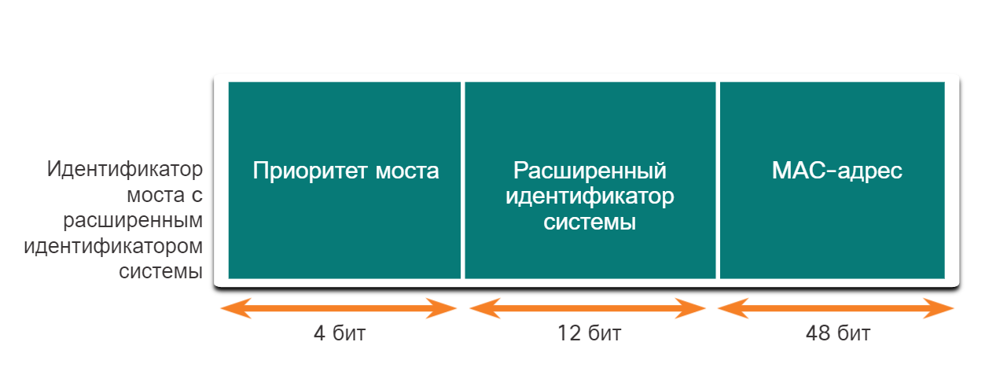
<!-- /courses/srwe-dl/af9ece92-34fe-11eb-b1b2-9b1b0c1f7e0d/afb6272a-34fe-11eb-b1b2-9b1b0c1f7e0d/assets/c9d2f751-1c27-11ea-af09-3b2e6521927c.svg -->

BID включает в себя приоритет моста, расширенный идентификатор системы и MAC-адрес коммутатора.

**Bridge Priority**

Значение приоритета по умолчанию для всех коммутаторов Cisco равно десятичному значению 32768. Значения варьируются в диапазоне от 0 до 61440 с шагом в 4096. Предпочтительнее более низкий приоритет моста . Приоритет моста 0 имеет преимущество по сравнению со всеми остальными значениями приоритета моста.

**Extended System ID**

Значение расширенного идентификатора системы — это десятичное значение, добавляемое к значению приоритета моста в BID для определения приоритета и сети VLAN кадра BPDU.

Для сетей, в которых не использовались сети VLAN, разработаны более ранние реализации IEEE 802.1D. На всех коммутаторах использовалось один общий протокол spanning-tree. По этой причине в старых коммутаторах расширенный идентификатор системы не был включен в BPDU. Так как сети VLAN получили распространение, поскольку они позволяют сегментировать сетевую инфраструктуру, стандарт 802.1D был усовершенствован с добавлением поддержки сетей VLAN, для чего потребовалось включение в кадр BPDU идентификатора сети VLAN. Сведения о сети VLAN включены в кадр BPDU с помощью расширенного идентификатора системы.

Расширенный идентификатор системы позволяет более поздним реализациям STP, таким как Rapid STP (RSTP), иметь различные корневые мосты для разных наборов VLAN. Это может позволить использовать избыточные, непересылаемые каналы в топологии STP для одного набора VLAN другим набором VLAN с использованием другого корневого моста.

**MAC address**

Если два коммутатора настроены с одинаковым приоритетом, и у них одинаковый расширенный идентификатор системы, то коммутатор с наименьшим значением MAC-адреса, выраженным в шестнадцатеричном формате, получит меньший идентификатор BID.

<!-- 5.2.2 -->
## 1. Выбор корневого моста
STA назначает один из коммутаторов в качестве корневого моста и использует его как точку привязки для расчёта всех путей. Коммутаторы обмениваются BPDU для создания безпетельной топологии, начиная с выбора корневого моста.

Процесс выбора определяет, какой из коммутаторов станет корневым мостом. Все коммутаторы в домене широковещательной рассылки участвуют в процессе выбора. После загрузки коммутатора они начинают рассылать кадры BPDU с интервалом в две секунды. Эти кадры BPDU содержат BID передающего коммутатора и BID корневого моста, известный как Root ID.

Коммутатор с самым низким значением идентификатора моста (BID) становится корневым мостом. Сначала все коммутаторы объявляют себя корневым мостом с собственным BID, установленным в качестве корневого идентификатора. В конце концов коммутаторы узнают через обмен BPDU, у которых коммутатор имеет самый низкий BID и будет согласовывать один корневой мост.

На рисунке S1 выбирается корневой мост, так как он имеет самый низкий BID.

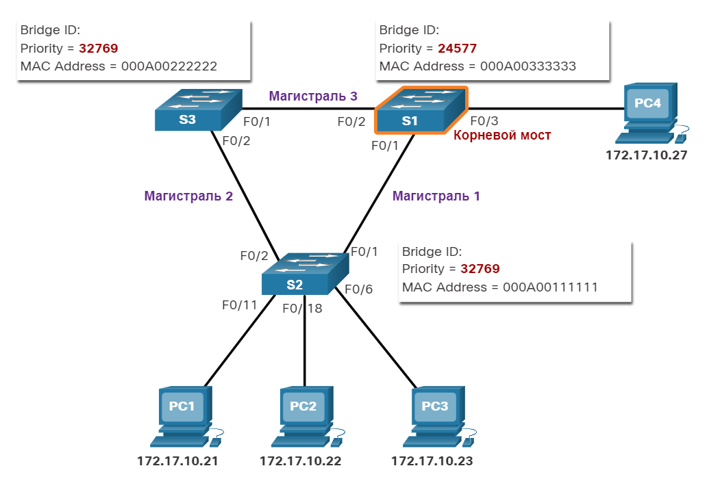
<!-- /courses/srwe-dl/af9ece92-34fe-11eb-b1b2-9b1b0c1f7e0d/afb6272a-34fe-11eb-b1b2-9b1b0c1f7e0d/assets/c9d39391-1c27-11ea-af09-3b2e6521927c.svg -->

<!-- 5.2.3 -->
## Влияние BID по умолчанию
Поскольку значение BID по умолчанию равно 32768, два или более коммутаторов могут иметь одинаковый приоритет. В этом сценарии, где приоритеты одинаковы, коммутатор с самым низким MAC-адресом станет корневым мостом. Чтобы гарантировать, что решение относительно корневого моста оптимально соответствует требованиям сети, администратору рекомендуется настроить выбранный коммутатор корневого моста с наименьшим приоритетом.

На рисунке все коммутаторы настроены с одинаковым приоритетом 32769. Здесь MAC-адрес становится решающим фактором в отношении того, какой коммутатор становится корневым мостом. MAC-адрес с самым низким шестнадцатеричным значением считается предпочтительным корневым мостом. В этом примере S2 имеет наименьшее значение MAC-адреса и, следовательно, назначается корневым мостом для этого экземпляра протокола spanning-tree.

**Примечание:** В этом примере для всех коммутаторов используется значение 32769. Это значение основано на значении приоритета по умолчанию 32768 и назначении сети VLAN 1, связанном с каждым из коммутаторов (32768+1).

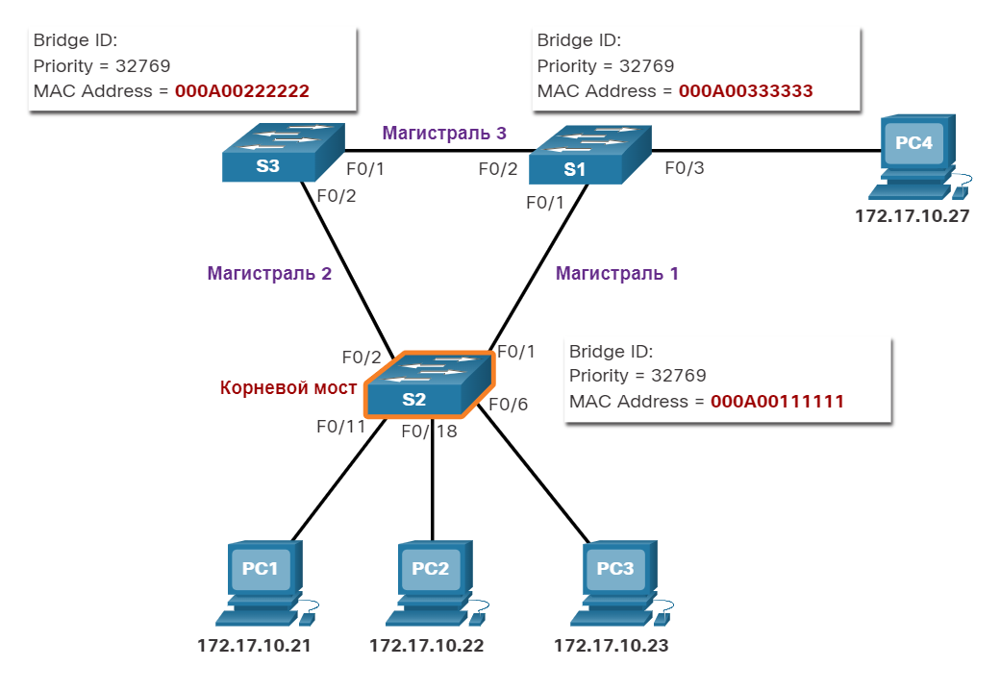
<!-- /courses/srwe-dl/af9ece92-34fe-11eb-b1b2-9b1b0c1f7e0d/afb6272a-34fe-11eb-b1b2-9b1b0c1f7e0d/assets/c9d408c2-1c27-11ea-af09-3b2e6521927c.svg -->

<!-- 5.2.4 -->
## Определение стоимости корневого пути

Если корневой мост выбран для экземпляра протокола spanning-tree, STA начинает процесс определения оптимальных путей к корневому мосту от всех некорневых коммутаторов в домене широковещательной рассылки. Информация о пути, известная как стоимость внутреннего корневого пути, равна сумме стоимости отдельных портов на пути от коммутатора к корневому мосту.

**Примечание:** BPDU включает стоимость корневого пути. Это стоимость пути от отправляющего коммутатора к корневому мосту.

Когда коммутатор получает блок BPDU, он добавляет стоимость входного порта сегмента для определения своей стоимости для внутреннего корневого пути.

Стоимость портов по умолчанию определяется скоростью работы порта. В таблице показаны расходы на порты по умолчанию, предложенные IEEE. Коммутаторы Cisco по умолчанию используют значения, определенные стандартом IEEE 802.1D, также известные как стоимость короткого пути, как для STP, так и для RSTP. Однако стандарт IEEE предлагает использовать значения, определенные в IEEE-802.1w, также известные как стоимость длинного пути, при использовании каналов 10 Гбит/с и быстрее.

**Примечание:** RSTP более подробно обсуждается в этом модуле позднее.

| **Скорость канала**	| **Стоимость STP: IEEE 802.1D-1998** |	**Стоимость RSTP: IEEE 802.1w-2004** |
| --- | --- | --- |
| 10 Гбит/с |	2 |	2 000 |
| 1 Гбит/с	| 4	| 20 000 |
| 100 Мбит/с | 19	| 200 000|
| 10 Мбит/с	| 100	| 2 000 000|

Хотя с портами коммутатора связано значение стоимости пути по умолчанию, значение стоимости порта можно настроить. Возможность настройки отдельных портов предоставляет администратору необходимую гибкость при контроле путей протокола spanning-tree к корневому мосту.

<!-- 5.2.5 -->
## 2. Выбор корневых портов.
После определения корневого моста для выбора корневого порта используется алгоритм STA. Каждый некорневой коммутатор выбирает один корневой порт. Корневые порты — порты коммутатора, ближайшие к корневому мосту с точки зрения общей стоимости маршрута к нему. Эта общая стоимость известна как стоимость пути до корневого моста.

Стоимость внутреннего корневого пути равна сумме стоимостей путей от всех портов к корневому мосту, как показано на рисунке. Пути с наименьшей стоимостью становятся предпочтительными, а все остальные избыточные пути блокируются. В этом примере стоимость внутреннего корневого пути от S2 до корневого моста S1 по пути 1 равна 19 (на основе указанной IEEE стоимости индивидуального порта), а стоимость внутреннего корневого пути для пути 2 равна 38. Поскольку общая стоимость пути 1 к корневому мосту ниже, именно этот путь является предпочтительным.

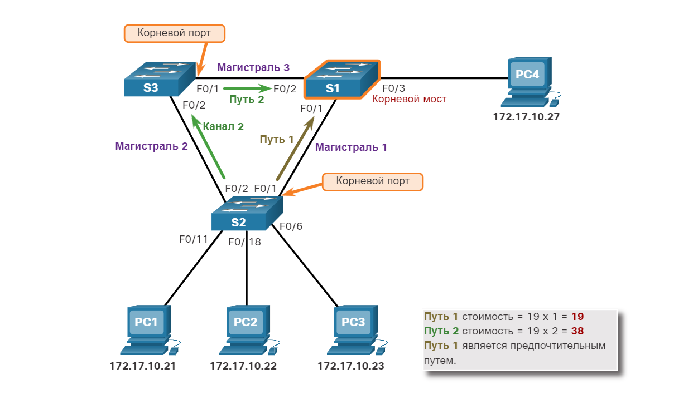
<!-- /courses/srwe-dl/af9ece92-34fe-11eb-b1b2-9b1b0c1f7e0d/afb6272a-34fe-11eb-b1b2-9b1b0c1f7e0d/assets/c9d4f322-1c27-11ea-af09-3b2e6521927c.svg -->

<!-- 5.2.6 -->
## 3. Выбор назначенных портов.
Часть предотвращения петель протокола связующего звена связующего дерева становится очевидной во время этих следующих двух шагов. После того, как каждый коммутатор выбирает корневой порт, коммутаторы будут выбирать назначенные порты.

Каждый сегмент между двумя коммутаторами будет иметь один назначенный порт. Назначенный порт — это порт в сегменте (с двумя коммутаторами), который имеет стоимость внутреннего корневого пути к корневому мосту. Другими словами, назначенный порт имеет наилучший путь для приема трафика, ведущего к корневому мосту.

То, что не является корневым или назначенным портом, становится альтернативным или заблокированным портом. Конечным результатом является один путь от каждого коммутатора к корневому мосту.

### Назначенные порты на корневом мосту

Все порты на корневом мосте являются назначенными портами. Это связано с тем, что корневой мост имеет самую низкую стоимость для себя.

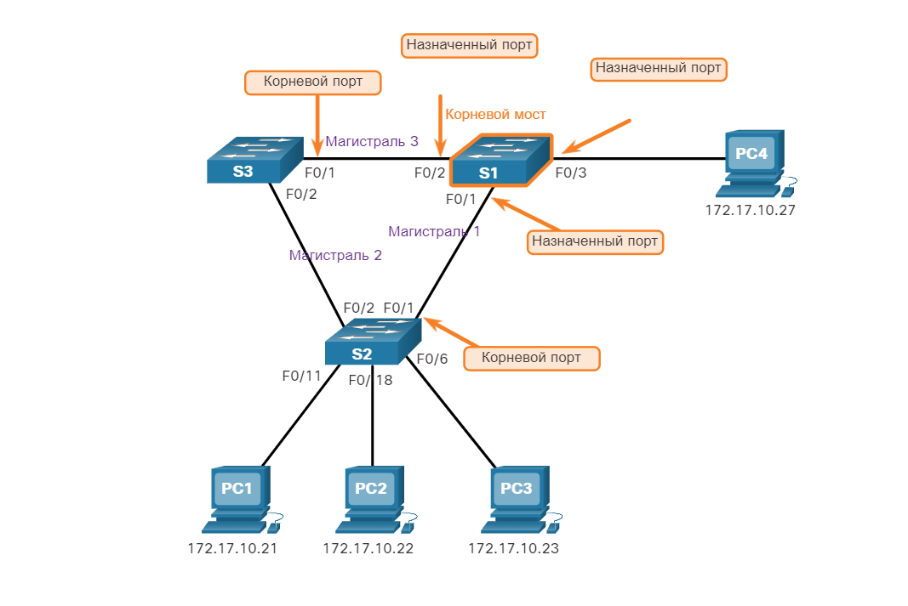
<!-- /courses/srwe-dl/af9ece92-34fe-11eb-b1b2-9b1b0c1f7e0d/afb6272a-34fe-11eb-b1b2-9b1b0c1f7e0d/assets/c9d5dd80-1c27-11ea-af09-3b2e6521927c.svg -->

Все порты на корневом мосте являются назначенными портами.

### Назначенный порт при наличии корневого порта

Если на одном конце сегмента находится корневой порт, на другом конце будет назначенный порт. Чтобы продемонстрировать это, на рисунке показано, что коммутатор S4 подключен к S3. Интерфейс Fa0/1 на S4 является его корневым портом, поскольку он имеет лучший и единственный путь к корневому мосту. Таким образом, интерфейс Fa0/3 на S3 на другом конце сегмента будет назначенным (определенным) портом.

**Примечание:** Все порты коммутатора с подключенными конечными устройствами (хостами) являются назначенными портами.

<!-- /courses/srwe-dl/af9ece92-34fe-11eb-b1b2-9b1b0c1f7e0d/afb6272a-34fe-11eb-b1b2-9b1b0c1f7e0d/assets/c9d652b2-1c27-11ea-af09-3b2e6521927c.svg -->

Интерфейс Fa0/1 на S4 является назначенным портом, потому что интерфейс Fa0/3 S3 является корневым портом.

### Назначенный порт при отсутствие корневого порта

Это оставляет только сегменты между двумя коммутаторами, где ни один из них не является корневым мостом. В этом случае порт коммутатора с наименьшей стоимостью пути к корневому мосту является назначенным портом для сегмента. Например, на рисунке последним сегментом является сегмент между S2 и S3. Оба S2 и S3 имеют одинаковую стоимость пути к корневому мосту. Алгоритм связующего дерева будет использовать идентификатор моста в качестве инструмента принятия решения. Хотя это не показано на рисунке, S2 имеет более низкий BID. Таким образом, порт F0/2 S2 будет выбран в качестве назначенного порта. Назначенные порты находятся в состоянии пересылки.

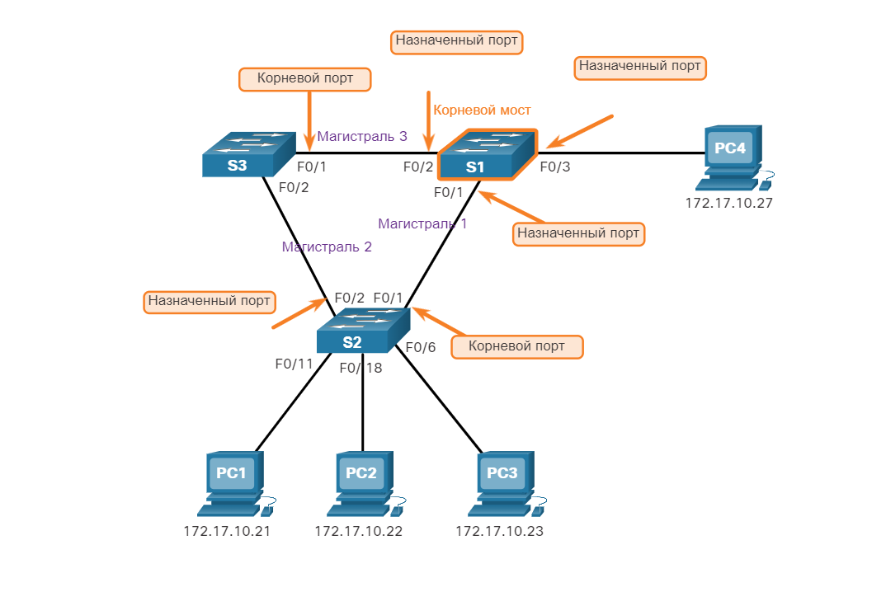
<!-- /courses/srwe-dl/af9ece92-34fe-11eb-b1b2-9b1b0c1f7e0d/afb6272a-34fe-11eb-b1b2-9b1b0c1f7e0d/assets/c9d6eef1-1c27-11ea-af09-3b2e6521927c.svg -->

Интерфейс Fa0/2 S2 является назначенным портом на сегменте с S3.

<!-- 5.2.7 -->
## 4. Выбор альтернативных (заблокированных) портов.

Если порт не является корневым или назначенным портом, он становится альтернативным (или резервным) портом. Альтернативные и резервные порты — находятся в состоянии отклонения или блокирования для предотвращения петель. На рисунке STA настроил порт F0/2 на коммутаторе S3 в роли альтернативного порта. Порт F0/2 на S3 находится в блокирующем состоянии и не будет пересылать кадры Ethernet. Все остальные порты между коммутаторами находятся в состоянии пересылки. Он работает как часть STP для предотвращения образования петель.

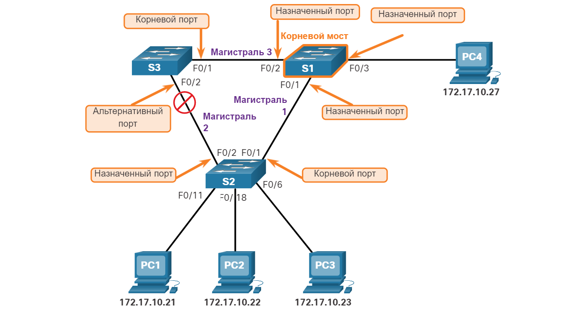
<!-- /courses/srwe-dl/af9ece92-34fe-11eb-b1b2-9b1b0c1f7e0d/afb6272a-34fe-11eb-b1b2-9b1b0c1f7e0d/assets/c9d78b32-1c27-11ea-af09-3b2e6521927c.svg -->

Интерфейс Fa0/2 S3 не является корневым портом или назначенным портом, поэтому он становится альтернативным или заблокированным портом.

<!-- 5.2.8 -->
## Выбор корневого порта из нескольких путей равной стоимости

Корневой порт и назначенные порты основаны на наименьшей стоимости пути к корневому мосту. Но что произойдет, если коммутатор имеет несколько равных по стоимости путей к корневому мосту? Как коммутатор определит корневой порт?

Если коммутатор имеет несколько путей равной стоимости к корневому мосту, коммутатор определяет порт, используя следующие критерии:

1. Самое низкое значение идентификатора BID моста-отправителя
2. Самое низкое значение приоритета порта-отправителя
3. Самое низкое значение идентификатора порта

### 1. Самое низкое значение идентификатора моста-отправителя

На рисунке показана топология с четырьмя коммутаторами, включая коммутатор S1 в качестве корневого моста. Если рассмотреть роли портов, порт F0/1 на коммутаторе S3 и порт F0/3 на коммутаторе S4 были выбраны в качестве корневых портов, поскольку они имеют наименьшую стоимость пути (стоимость корневого пути) к корневому мосту для соответствующих коммутаторов. S2 содержит два порта — F0/1 и F0/2 — с путями равной стоимости к корневому мосту. В этом случае для нарушения равнозначности будут использованы идентификаторы мостов соседних коммутаторов S3 и S4. Это называется BID отправителя. S3 имеет BID 32769.5555.5555.5555, а S4 имеет BID 32769.1111.1111.1111. Поскольку значение BID для S4 меньше, корневым портом будет порт коммутатора S2 F0/1, подключенный к S4.

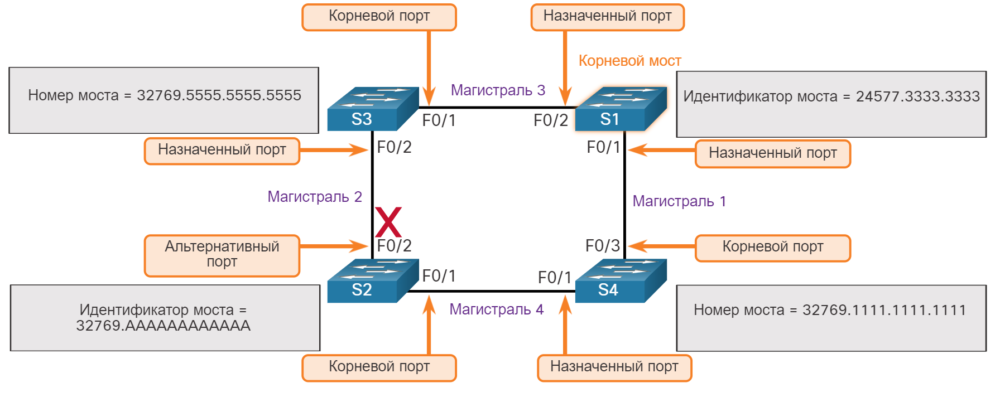
<!-- /courses/srwe-dl/af9ece92-34fe-11eb-b1b2-9b1b0c1f7e0d/afb6272a-34fe-11eb-b1b2-9b1b0c1f7e0d/assets/c9d87592-1c27-11ea-af09-3b2e6521927c.svg -->

### 2. Самое низкое значение приоритета порта-отправителя

Чтобы продемонстрировать эти два следующих критерия, топология изменяется на топологию, где два коммутатора соединены двумя путями равной стоимости между ними. S1 является корневым мостом, поэтому оба его порта являются назначенными портами.

S4 имеет два порта с равными по стоимости путями к корневому мосту. Поскольку оба порта подключены к одному коммутатору, BID отправителя (S1) равен. Итак, первый шаг - ничья.

Далее в списке находится приоритет порта отправителя (S1). Приоритет порта по умолчанию равен 128, поэтому оба порта S1 имеют одинаковый приоритет порта. Это тоже ничья. Однако, если любой порт на S1 настроен с более низким приоритетом порта, S4 помещал бы свой смежный порт в состояние пересылки. Другой порт на S4 будет блокирующим состоянием.

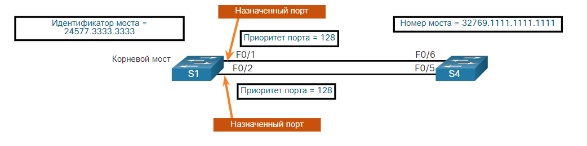
<!-- /courses/srwe-dl/af9ece92-34fe-11eb-b1b2-9b1b0c1f7e0d/afb6272a-34fe-11eb-b1b2-9b1b0c1f7e0d/assets/c9d938e2-1c27-11ea-af09-3b2e6521927c.svg -->

### 3. Самое низкое значение идентификатора порта

Последний определитель - является самым низким идентификатором порта отправителя. Коммутатор S4 получил BPDU от порта F0/1 и порта F0/2 на S1. Помните, что решение основано на идентификаторе порта отправителя, а не на идентификаторе порта получателя. Поскольку идентификатор порта F0/1 на S1 меньше, чем порт F0/2, порт F0/6 коммутатора S4 будет корневым портом. Это порт на S4, который подключен к порту F0/1 на S1.

Порт F0/5 на S4 станет альтернативным портом и будет помещен в состояние блокировки, которое является частью STP для предотвращения петли.

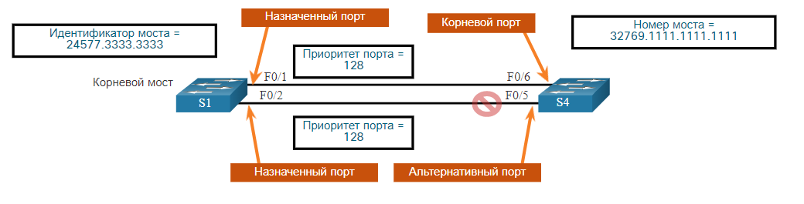
<!-- /courses/srwe-dl/af9ece92-34fe-11eb-b1b2-9b1b0c1f7e0d/afb6272a-34fe-11eb-b1b2-9b1b0c1f7e0d/assets/c9d9ae10-1c27-11ea-af09-3b2e6521927c.svg -->

<!-- 5.2.9 -->
## Таймеры STP и состояния портов
Для конвергенции STP требуется три таймера, а именно:

- **Hello Timer** - Время приветствия (hello time) - это интервал между BPDU. По умолчанию это значение равно 2 секундам, но его можно настроить в диапазоне от 1 до 10 секунд. 
- **Forward Delay Timer** - Таймер задержки пересылки (Forward Delay Timer) (15 секунд) — время, проводимое в состояниях прослушивания и обучения. Значение по умолчанию составляет 15 секунд, но может быть изменено на 4-30 секунд.
- **Max Age Timer** Максимальный возраст (max age) — это максимальное время ожидания коммутатора перед попыткой изменения топологии STP. По умолчанию это значение равно 20 секундам, но его можно настроить в диапазоне от 6 до 40 секунд.

**Примечание:** Время по умолчанию может быть изменено на корневом мосту, который определяет значение этих таймеров для домена STP.

Протокол STP упрощает создание логического беспетлевого пути по домену широковещательной рассылки. Протокол spanning-tree определяется с помощью данных, полученных в процессе обмена кадрами BPDU между соединенными друг с другом коммутаторами. Если порт коммутатора переходит непосредственно из состояния блокирования в состояние пересылки, не получив информацию о полной топологии в процессе перехода, он может временно создать петлю данных. По этой причине STP имеет пять состояний портов, четыре из которых являются рабочими состояниями портов, как показано на рисунке.ч Отключенное состояние считается неработоспособным.

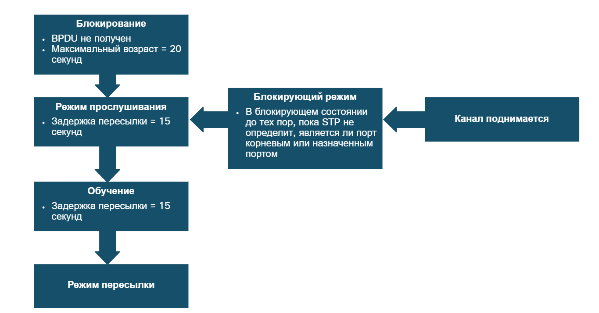
<!-- /courses/srwe-dl/af9ece92-34fe-11eb-b1b2-9b1b0c1f7e0d/afb6272a-34fe-11eb-b1b2-9b1b0c1f7e0d/assets/c9da2342-1c27-11ea-af09-3b2e6521927c.svg -->

Подробные сведения о каждом состоянии порта приведены в таблице.

| **Состояние порта**	| **Описание** |
| --- | --- |
| Блокирующий режим |	Порт является альтернативным и не участвует в пересылке кадров. Порт получает кадры BPDU для определения местоположения и корневого идентификатора корневого моста. Кадры BPDU также определяют роли портов, которые каждый порт коммутатора должен принимать в окончательной активной топологии STP. С таймером максимального возраста 20 секунд порт коммутатора, который не получил ожидаемый BPDU от соседнего коммутатора, перейдет в состояние блокировки. |
| Режим прослушивания	| После состояния блокировки порт перейдет в состояние прослушивания. Порт получает BPDU для определения пути к корню. Порт коммутатора также передает свои собственные кадры BPDU и сообщает смежным коммутаторам, что порт коммутатора готовится к участию в активной топологии. |
| Обучение	| Порт коммутатора переходит в состояние обучения после состояния прослушивания. Во время обучения порт коммутатора получает и обрабатывает BPDU и готовится к участию в пересылке кадров. Он также начинает заполнять таблицу MAC-адресов. Однако в состоянии обучения пользовательские кадры не передаются. |
| Режим пересылки	| В состоянии пересылки порт коммутатора считается частью активной топологии. Порт коммутатора пересылает пользовательский трафик, отправляет и получает кадры BPDU. |
| Отключено |	Порт коммутатора в отключенном состоянии не участвует в связующем дереве и не пересылает кадры. Отключенное состояние устанавливается, когда порт коммутатора административно отключен. |

<!-- 5.2.10 -->
## Эксплуатационные данные каждого состояния порта

В таблице приведены рабочие подробности каждого состояния порта.

| **Состояние порта** | **BPDU** | **Таблица MAC-адресов** | **Пересылка кадров данных** | 
| --- | --- | --- | --- |
| Блокирующий режим |	Только получение | Без обновления	| Нет |
| Режим прослушивания	| Получение и отправка | Без обновления | Нет |
| Обучение | Получение и отправка |	Обновление таблицы |Нет |
| Режим пересылки	| Получение и отправка |	Обновление таблицы |	Да |
| Отключено	| Не отправлено или получено |	Без обновления |	Нет |

<!-- 5.2.11 -->
## Протокол PerVLAN Spanning Tree Protocol.

До сих пор мы обсуждали STP в среде, где существует только одна VLAN. Однако STP можно настроить для работы в среде с несколькими VLAN.

В версиях STP для каждого VLAN Spanning Tree (PVST) существует корневой мост, выбранный для каждого экземпляра связующего дерева. Возможно наличие нескольких отдельных корневых мостов для различных наборов сетей VLAN. STP управляет отдельным экземпляром STP для каждой отдельной VLAN. Если все порты на всех коммутаторах являются участниками сети VLAN 1, значит, существует только один экземпляр протокола spanning-tree.

<!-- 5.2.12 - Проверьте сове понимание темы - Принципы работы STP. - quiz-->
