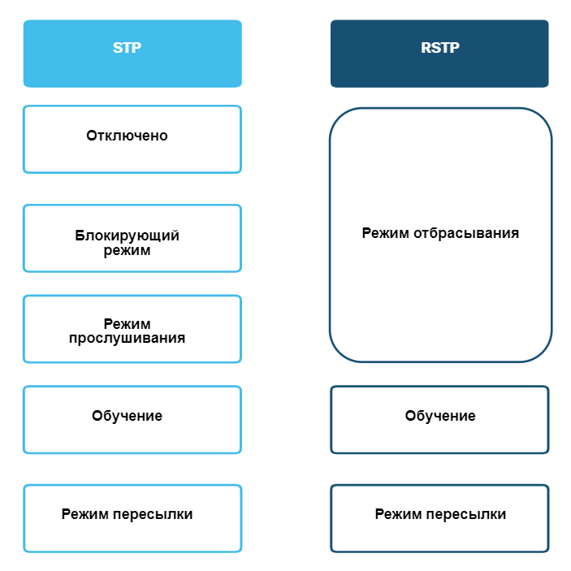
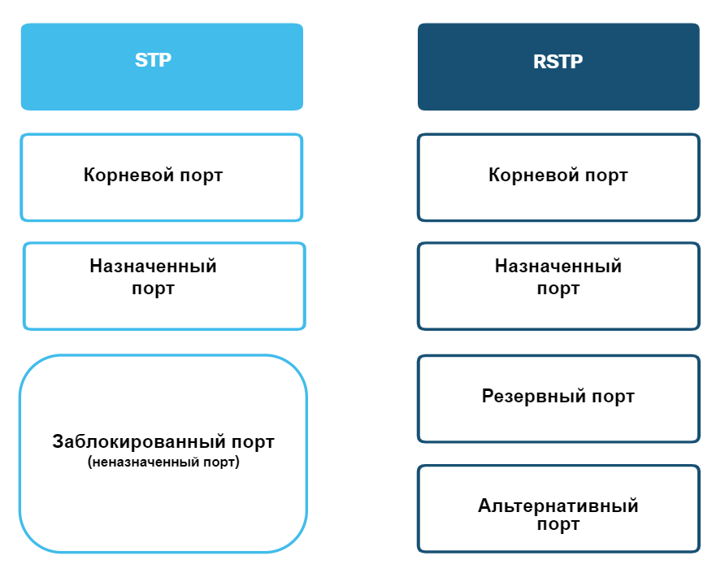
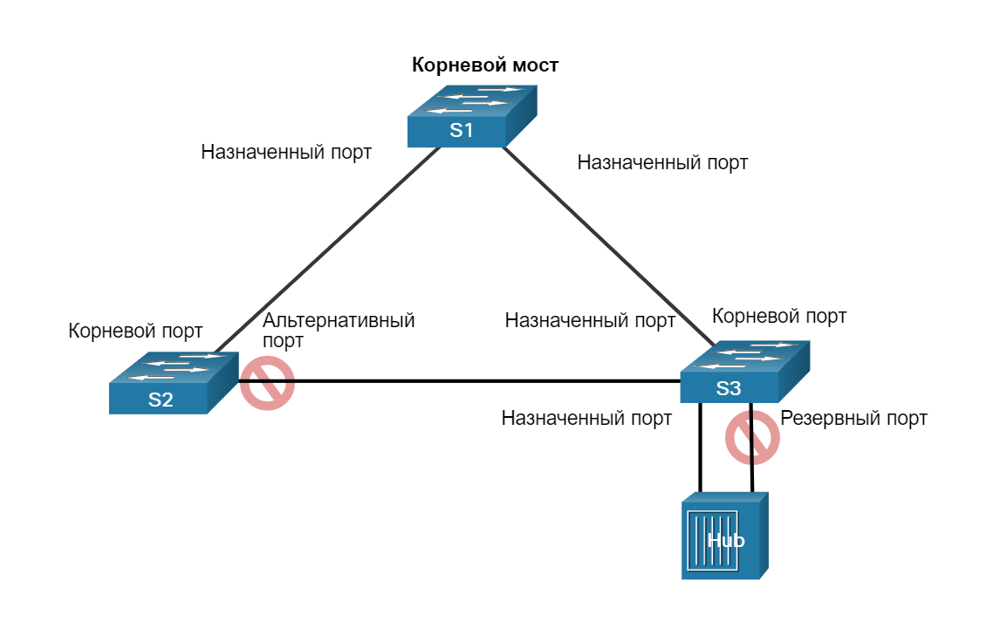
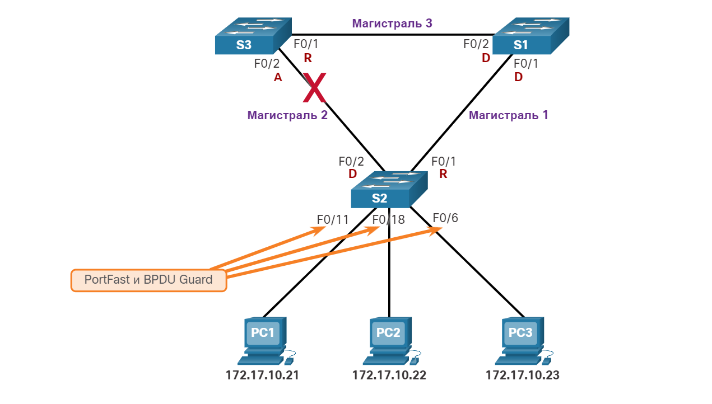
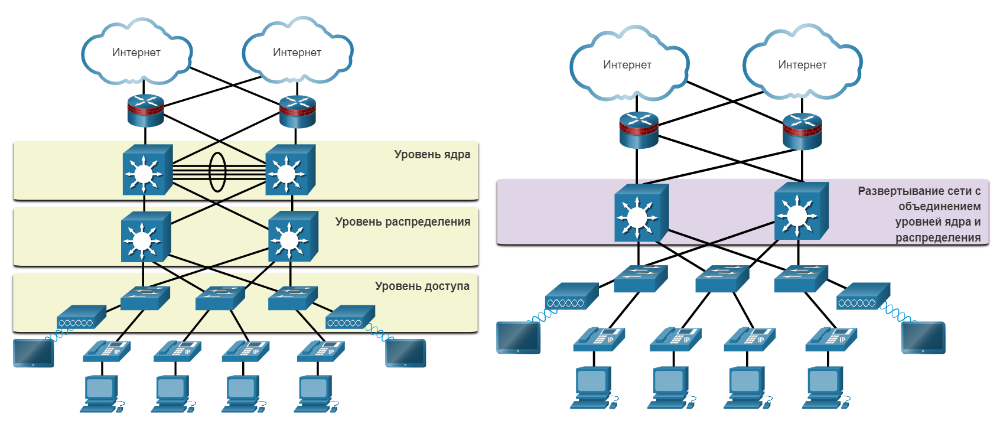
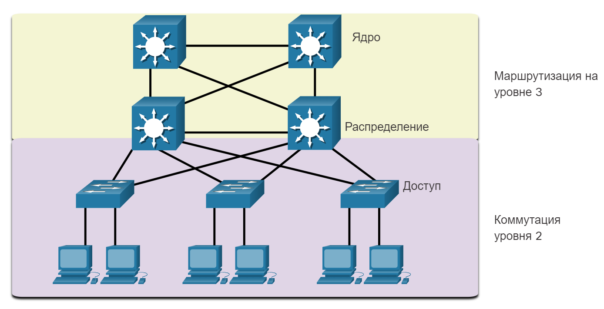
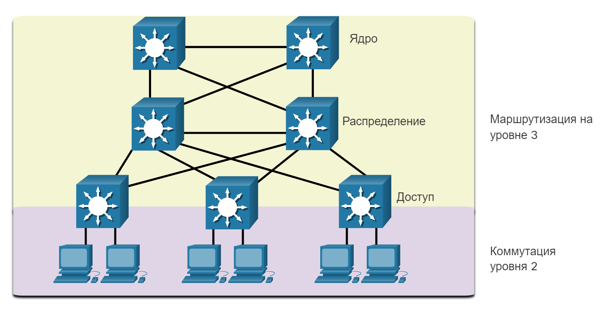

# Эволюция STP

<!-- 5.3.1 -->
## Различные версии STP
В этом разделе подробно описаны различные версии STP и другие варианты предотвращения циклов в сети.

До сих пор использовался термин Spanning Tree Protocol (протокол spanning-tree) и аббревиатура STP. Многие специалисты используют данный термин и аббревиатуру для обозначения различных реализаций протокола spanning-tree, например протокола Rapid Spanning Tree Protocol (RSTP) и протокола Multiple Spanning Tree Protocol (MSTP). Чтобы правильно объяснять принципы протокола spanning-tree, важно понимать, о какой конкретно реализации или стандарте идет речь в данном контексте.

Последний стандарт связующего дерева содержится в IEEE-802-1D-2004, стандарте IEEE для локальных и городских сетей: MAC-мосты В этой версии стандарта указано, что коммутаторы и мосты, соответствующие стандарту, будут использовать протокол RSTP вместо старого протокола STP, указанного в исходном стандарте 802.1d. В рамках данной программы, если в контексте обсуждения речь идет об исходном протоколе STP, то во избежание расхождений используется фраза: «исходный протокол spanning-tree 802.1D». Так как в этих двух протоколах используется по большей части одинаковая терминология и методы обеспечения пути без петель, основной акцент будет сделан на текущем стандарте и собственных реализациях Cisco для протоколов STP и RSTP.

С момента создания исходного стандарта IEEE 802.1D было разработано несколько разновидностей протоколов STP.

| **Варианты STP** | **Описание** |
| --- | --- |
| STP | Это исходная версия IEEE 802.1D (802.1D-1998 и более ранних версий), которая предоставляет топологию без петли в сети с избыточными каналами. Также называется общим связующим деревом (CST), он предполагает один экземпляр связующего дерева независимо от количества сетей VLAN. |
| PVST+ | Per-VLAN Spanning Tree (PVST+) — это усовершенствованная технология STP Cisco, которая предоставляет отдельный экземпляр протокола spanning-tree 802.1D для каждой VLAN, настроенной в сети. Рассматриваемый вариант протокола spanning-tree поддерживает PortFast, UplinkFast, BPDU guard, BPDU filter, root guard и loop guard. |
| 802.1D-2004 | Обновленная версия стандарта STP, в которую входит 802.1w. |
| RSTP | Протокол быстрого связующего дерева (RSTP) или IEEE 802.1w представляет собой эволюцию STP, обеспечивающий более высокую сходимость, чем STP. |
| Rapid PVST+ | Усовершенствованный корпорацией Cisco протокол RSTP, который использует PVST+, предоставляя отдельный экземпляр 802.1w для каждой сети VLAN. Каждый отдельный экземпляр поддерживает POrtFast, BPDU guard, BPDU filter, root guard и loop guard.
| MSTP | Протокол нескольких связующих деревьев (MSTP) является стандартом IEEE, вдохновленным ранее проприетарный Cisco протокол STP с несколькими экземпляром (MISTP). MSTP сопоставляет несколько сетей VLAN в пределах одного экземпляра протокола spanning-tree. |
| MST | Multiple Spanning Tree (MST) представляет собой реализацию Cisco MSTP, которая предоставляет до 16 экземпляров RSTP и объединяет множество VLAN с той же физической и логической топологией в общий экземпляр RSTP. Каждый рассматриваемый вариант протокола spanning-tree поддерживает PortFast, BPDU guard, BPDU filter, root guard и loop guard. |

Сетевому специалисту, который отвечает за администрирование коммутаторов, может потребоваться принять решение относительно того, какой тип протокола STP необходимо реализовать. 

Коммутаторы Cisco под управлением IOS 15.0 или более поздней версии по умолчанию запускают PVST+. Эта версия содержит множество спецификаций IEEE 802.1D-2004, таких как альтернативные порты вместо бывших неназначенных портов. Однако, чтобы использовать протокол RSTP, коммутаторы должны быть явно настроены на быстрый режим связующего дерева.

<!-- 5.3.2 -->
## Принципы STP
Протокол RSTP (802.1w) заменяет собой исходный стандарт 802.1D, поддерживая при этом функции обратной совместимости. Терминология, относящаяся к STP 802.1w, остается в основном той же, что и для исходного стандарта STP IEEE 802.1D. Большинство параметров остались без изменений. Пользователи, знакомые с исходным стандартом STP, могут легко настроить RSTP. Один и тот же алгоритм связующего дерева используется для STP и RSTP для определения ролей портов и топологии.

Протокол RSTP ускоряет повторный расчёт протокола spanning-tree в случае изменения топологии сети 2-го уровня. В правильно настроенной сети RSTP может достичь состояния сходимости гораздо быстрее, иногда всего за несколько сот миллисекунд. Если порт настроен альтернативным или резервным, он может немедленно перейти в состояние пересылки без ожидания сходимости сети.

**Примечание:** Rapid PVST+ представляет собой реализацию RSTP Cisco на основе отдельных VLAN. Для каждой VLAN запускается независимый экземпляр RSTP.

<!-- 5.3.3 -->
## RSTP состояния и роли портов

Состояний портов и роли портов между STP и RSTP схожи.

### Состояния портов STP и RSTP

Как показано на рисунке, в RSTP имеется только три состояния порта, которые соответствуют трем возможным рабочим состояниям STP. Состояние отключения, блокировки и прослушивания 802.1D объединяются в уникальное состояние отказа 802.1w.

<!-- /courses/srwe-dl/af9ece92-34fe-11eb-b1b2-9b1b0c1f7e0d/afb64e30-34fe-11eb-b1b2-9b1b0c1f7e0d/assets/c9de9012-1c27-11ea-af09-3b2e6521927c.svg -->

### Роли портов STP и RSTP

Как показано на рисунке, корневые порты и назначенные порты одинаковы для STP и RSTP. Тем не менее существует две роли порта RSTP, которые соответствуют состоянию блокировки STP. В STP заблокированный порт определяется как не являющийся назначенным или корневым портом. Для этой цели RSTP имеет две роли портов.

<!-- /courses/srwe-dl/af9ece92-34fe-11eb-b1b2-9b1b0c1f7e0d/afb64e30-34fe-11eb-b1b2-9b1b0c1f7e0d/assets/c9df0541-1c27-11ea-af09-3b2e6521927c.svg -->

### Альтернативные порты и порты резервные RSTP

Как показано на рисунке, альтернативный порт имеет альтернативный путь к корневому мосту. Резервный порт является резервным к общей среде, в такой как концентратор (hub). Резервный порт менее распространен, поскольку концентраторы в настоящее время считаются устаревшими устройствами.

<!-- /courses/srwe-dl/af9ece92-34fe-11eb-b1b2-9b1b0c1f7e0d/afb64e30-34fe-11eb-b1b2-9b1b0c1f7e0d/assets/c9df7a70-1c27-11ea-af09-3b2e6521927c.svg -->

<!-- 5.3.4 -->
## PortFast и BPDU Guard

Когда устройство подключено к порту коммутатора или когда коммутатор включается, порт коммутатора проходит как прослушивание, так и обучение, каждый раз ожидая истечения срока действия таймера задержки вперед. Эта задержка составляет 15 секунд для каждого состояния, прослушивания и обучения, в общей сложности 30 секунд. Эта задержка может вызвать проблему для DHCP-клиентов, пытающихся обнаружить DHCP-сервер. Сообщения DHCP от подключенного узла не будут пересылаться в течение 30 секунд таймеров задержки пересылки, и процесс DHCP может тайм-аут. В результате клиент IPv4 не получит действительный адрес IPv4.

**Примечание:** Хотя это может произойти при отправке клиентами сообщений ICMPv6 Router Solicitation, маршрутизатор будет продолжать отправлять сообщения ICMPv6 Router Advertisement, чтобы устройство было знать, как получить информацию об адресе.

Если порт коммутатора настроен с помощью функции PortFast, то такой порт сразу переходит из состояния блокировки в состояние пересылки, минуя стандартные состояния перехода STP 802.1D (состояния прослушивания и получения данных). Вместо того, чтобы ожидать схождения протокола STP IEEE 802.1D в каждой сети VLAN, PortFast можно использовать на портах доступа для обеспечения немедленного подключения этих устройств к сети. Поскольку PortFast предназначен для минимизации времени ожидания портами доступа схождения протокола spanning-tree, эту функцию рекомендуется использовать только на портах доступа. Если функция PortFast включена на порте, подключенном к другому коммутатору, возникнет риск возникновения петли протокола spanning-tree. PortFast предназначен только для портов коммутатора, подключенных к конечным устройствам.

<!-- /courses/srwe-dl/af9ece92-34fe-11eb-b1b2-9b1b0c1f7e0d/afb64e30-34fe-11eb-b1b2-9b1b0c1f7e0d/assets/c9dfefa2-1c27-11ea-af09-3b2e6521927c.svg -->

В допустимой конфигурации PortFast прием кадров BPDU никогда не допускается, поскольку это указывало бы на то, что к порту подключен другой мост или коммутатор, а это может привести к возникновению петли протокола spanning-tree. Это потенциально вызывает цикл связующего дерева. Чтобы предотвратить возникновение такого типа сценариев, коммутаторы Cisco поддерживают функцию, называемую BPDU guard. Когда функция BPDU guard включена, при получении блока BPDU она переводит порт в состояние errdisabled (error-disabled — отключение из-за ошибки). Это защищает от потенциальных петель, эффективно отключив порт. Функция BPDU guard обеспечивает безопасный отклик на недопустимые конфигурации, чтобы вы могли вручную повторно подключить интерфейс.

<!-- 5.3.5 -->
## Альтернативы STP

STP был и остается протоколом предотвращения петель Ethernet. С годами организациям требовалась повышенная отказоустойчивость и доступность локальной сети. Сетевые сети Ethernet перешли от нескольких взаимосвязанных коммутаторов, подключенных к одному маршрутизатору, к сложной иерархической структуре сети, включающей коммутаторы доступа, распределения и основного уровня, как показано на рисунке.

Две топологии физической сети, показывающие иерархическую структуру сети и свернутый основной проект

<!-- /courses/srwe-dl/af9ece92-34fe-11eb-b1b2-9b1b0c1f7e0d/afb64e30-34fe-11eb-b1b2-9b1b0c1f7e0d/assets/c9e0b2f0-1c27-11ea-af09-3b2e6521927c.svg -->

В зависимости от реализации уровень 2 может включать не только уровень доступа, но и распределение или даже уровни ядра. Эти топологии могут включать сотни коммутаторов с сотнями или даже тысячами VLAN. STP адаптировалась к дополнительной избыточности и сложности благодаря усовершенствованиям, как часть RSTP и MSTP.

Важным аспектом проектирования сети является быстрая и предсказуемая сходимость при сбое или изменении топологии. Связующее дерево не обеспечивает такую же эффективность и предсказуемость, которая обеспечивается протоколами маршрутизации на уровне 3. На рисунке показана традиционная иерархическая структура сети с распределением и основными многослойными коммутаторами, выполняющими маршрутизацию.

Топология физической сети показывает четыре коммутатора уровня 3, три коммутатора уровня 2 и шесть ПК. Два коммутатора уровня 3 в верхней части топологии находятся в ядре. Два коммутатора уровня 3 находятся на уровне распределения. Три коммутатора уровня 2 и шесть ПК находятся на уровне Access.

<!-- /courses/srwe-dl/af9ece92-34fe-11eb-b1b2-9b1b0c1f7e0d/afb64e30-34fe-11eb-b1b2-9b1b0c1f7e0d/assets/c9e12820-1c27-11ea-af09-3b2e6521927c.svg -->

Маршрутизация уровня 3 позволяет создавать избыточные пути и петли в топологии без блокировки портов. По этой причине некоторые среды переходят на уровень 3 везде, за исключением тех случаев, когда устройства подключаются к коммутатору уровня доступа. Другими словами, соединения между коммутаторами уровня доступа и коммутаторами распределения будут иметь уровень 3, а не уровень 2, как показано на следующем рисунке.

Топология физической сети показывает семь коммутаторов уровня 3 и шесть ПК. Два коммутатора уровня 3 в верхней части топологии находятся в ядре. Два коммутатора уровня 3 находятся на уровне распределения. Три коммутатора уровня 3 соединяют слои распределения и доступа. Шесть ПК полностью находятся на уровне доступа.

<!-- /courses/srwe-dl/af9ece92-34fe-11eb-b1b2-9b1b0c1f7e0d/afb64e30-34fe-11eb-b1b2-9b1b0c1f7e0d/assets/c9e17642-1c27-11ea-af09-3b2e6521927c.svg -->

Хотя STP, скорее всего, будет и впредь использоваться в качестве механизма предотвращения петли на предприятии, на коммутаторах уровня доступа используются и другие технологии, в том числе следующие:

- Агрегация многосистемных связей (MLAG) (Multi System Link Aggregation)
- Мостовое соединение по кратчайшему пути (Shortest Path Bridging) (SPB)
- Прозрачное соединение множества каналов друг с другом (Transparent Interconnect of Lots of Links (TRILL))

**Примечание:** Эти технологии выходят за рамки данного курса.

<!-- 5.3.6 Проверьте свое понимание темы - Эволюция STP - quiz -->
