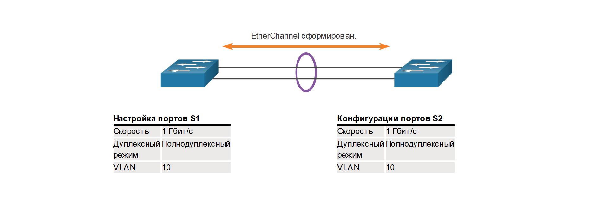
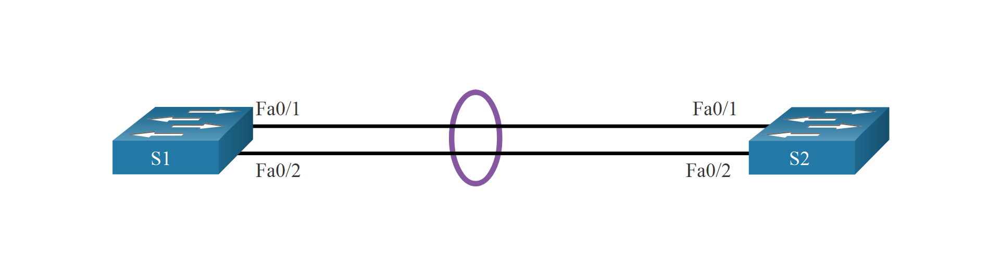

<!-- 6.2.1 -->
## Инструкции по настройке

Теперь, когда вы знаете, что такое EtherChannel, в этом разделе объясняется, как его настроить. При настройке EtherChannel рекомендуется соблюдать следующие инструкции и ограничения:

* **Поддержка EtherChannel.** Все интерфейсы Ethernet должны поддерживать EtherChannel; при этом не требуется, чтобы эти интерфейсы были физически смежными.
* **Скорость и режим дуплекса.** Настройте все интерфейсы в EtherChannel для работы на одной скорости и в одном режиме дуплекса.
* **Сопоставление сетей VLAN.** Все интерфейсы в объединении EtherChannel должны быть назначены в один VLAN или настроены в качестве транкового канала (показано на рисунке).
* **Диапазон VLAN** \- EtherChannel поддерживает одинаковые разрешенные диапазоны сетей VLAN на всех интерфейсах в канале транкинга EtherChannel. Если разрешённый диапазон сетей VLAN не совпадает, интерфейсы не смогут создать EtherChannel даже при выборе **auto** или **desirable**.

На рисунке показана конфигурация, которая позволит сформировать канал EtherChannel между S1 и S2.


<!-- /courses/srwe-dl/af9ece94-34fe-11eb-b1b2-9b1b0c1f7e0d/afb67541-34fe-11eb-b1b2-9b1b0c1f7e0d/assets/c9ec99d0-1c27-11ea-af09-3b2e6521927c.svg -->

EtherChannel формируется, когда настройки конфигурации совпадают на обоих коммутаторах.

На следующем рисунке на портах S1 настроен полудуплекс. Поэтому не удается сформировать канал EtherChannel между S1 и S2.


<!-- /courses/srwe-dl/af9ece94-34fe-11eb-b1b2-9b1b0c1f7e0d/afb67541-34fe-11eb-b1b2-9b1b0c1f7e0d/assets/c9ed0f01-1c27-11ea-af09-3b2e6521927c.svg -->

EtherChannel не формируется, когда параметры конфигурации на каждом коммутаторе различаются.

Если данные параметры необходимо изменить, настройку следует выполнять в режиме конфигурации интерфейса агрегированного канала. Любая конфигурация, применяемая к интерфейсу канала порта, также влияет на отдельные интерфейсы. Однако конфигурации, примененные к отдельным интерфейсам, не влияют на интерфейс агрегированного канала. Следовательно, изменение конфигурации интерфейса, относящегося к каналу EtherChannel, может вызвать проблемы с совместимостью.

Канал порта можно настроить в режиме доступа (access), режиме магистрали (trunk) (самом распространенном) либо на маршрутизируемом порте.

<!-- 6.2.2 -->
## Пример конфигурации LACP

EtherChannel по умолчанию отключен и должен быть настроен. Топология на рисунке будет использоваться для демонстрации примера конфигурации EtherChannel с использованием LACP.


<!-- /courses/srwe-dl/af9ece94-34fe-11eb-b1b2-9b1b0c1f7e0d/afb67541-34fe-11eb-b1b2-9b1b0c1f7e0d/assets/c9ed8431-1c27-11ea-af09-3b2e6521927c.svg -->

Настройка EtherChannel с использованием LACP выполняется в три шага:

**Шаг 1.** Определите интерфейсы, составляющие группу EtherChannel, с помощью команды **interface range** _interface_. Ключевое слово **range** позволяет выбрать несколько интерфейсов и настроить их одновременно.

**Шаг 2.** Создайте интерфейс канала порта с помощью **channel-group** команды **mode active** _identifier_ в режиме конфигурации диапазона интерфейса. Идентификатор задает номер группы каналов. Ключевые слова **mode active** определяют его как конфигурацию EtherChannel LACP.

**Шаг 3.** Чтобы изменить настройки 2-го уровня на интерфейсе канала порта, перейдите в режим интерфейсной настройки канала порта с помощью команды **interface port-channel**, после которой необходимо указать идентификатор интерфейса. В этом примере S1 настроен с EtherChannel LACP. Канал порта настраивается в качестве транкового интерфейса с указанием разрешенных сетей VLAN.

```
S1(config)# interface range FastEthernet 0/1 - 2
S1(config-if-range)# channel-group 1 mode active
Creating a port-channel interface Port-channel 1
S1(config-if-range)# exit
S1(config)# interface port-channel 1
S1(config-if)# switchport mode trunk
S1(config-if)# switchport trunk allowed vlan 1,2,20
```

<!-- 6.2.3 -->
<!-- syntax -->

<!-- 6.2.4 -->
## Packet Tracer. Настройка EtherChannel

Только что были установлены три коммутатора. Между коммутаторами настроены избыточные каналы. Обычно можно использовать лишь один из этих каналов, иначе может возникнуть петля на втором уровне модели OSI. Однако при эксплуатации одного канала используется только половина доступной пропускной способности. EtherChannel позволяет объединять до восьми избыточных каналов в один логический. В этой лабораторной работе вам предстоит настроить протокол агрегирования портов (PAgP), протокол Cisco EtherChannel и протокол управления агрегированием каналов (LACP), версию EtherChannel открытого стандарта IEEE 802.3ad.

[Настройка EtherChannel (pdf)](./assets/6.2.4-packet-tracer---configure-etherchannel_ru-RU.pdf)

[Настройка EtherChannel (pka)](./assets/6.2.4-packet-tracer---configure-etherchannel_ru-RU.pka)

