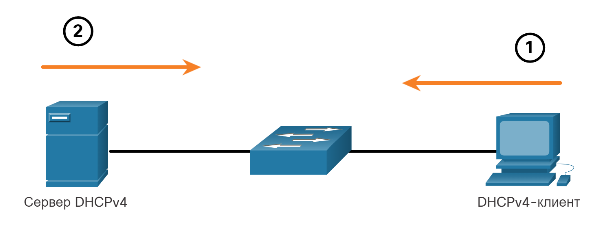
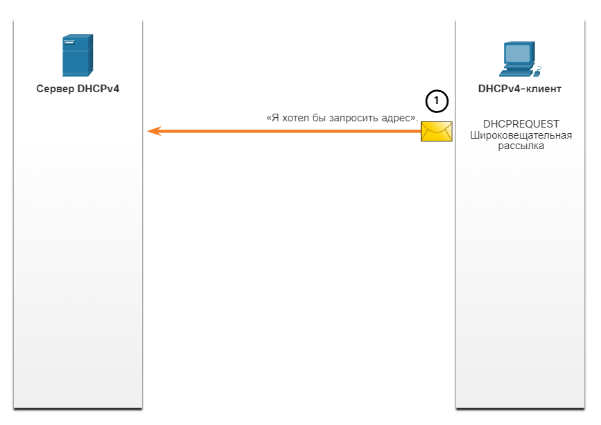
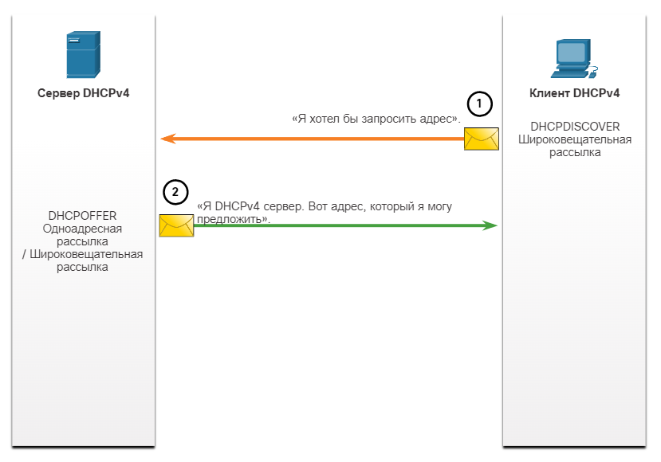
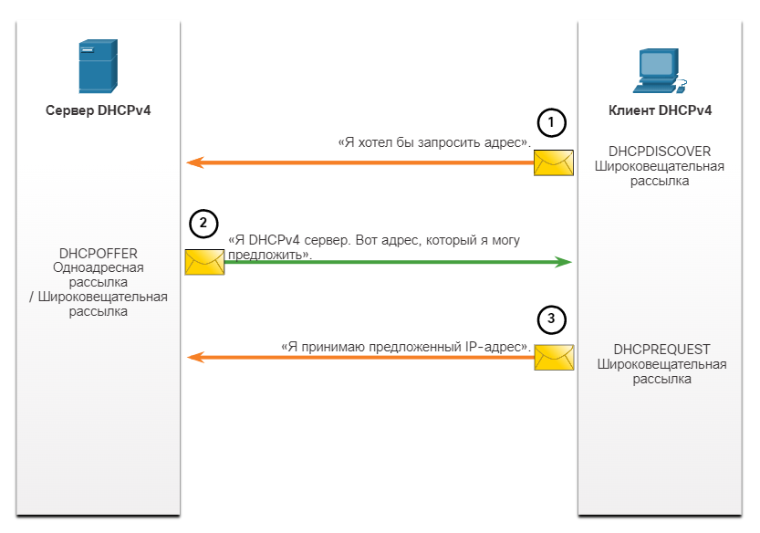
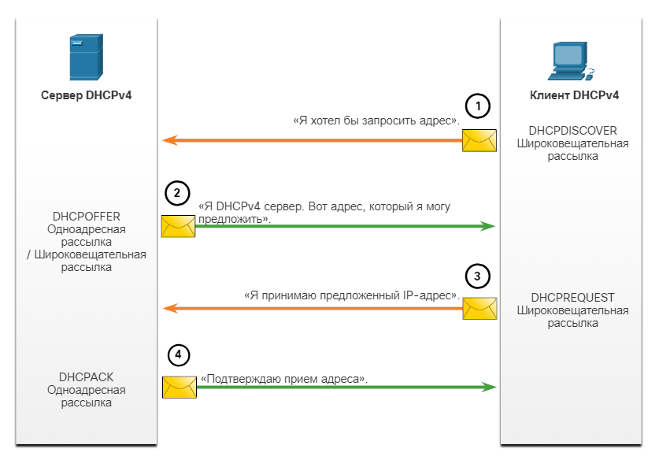
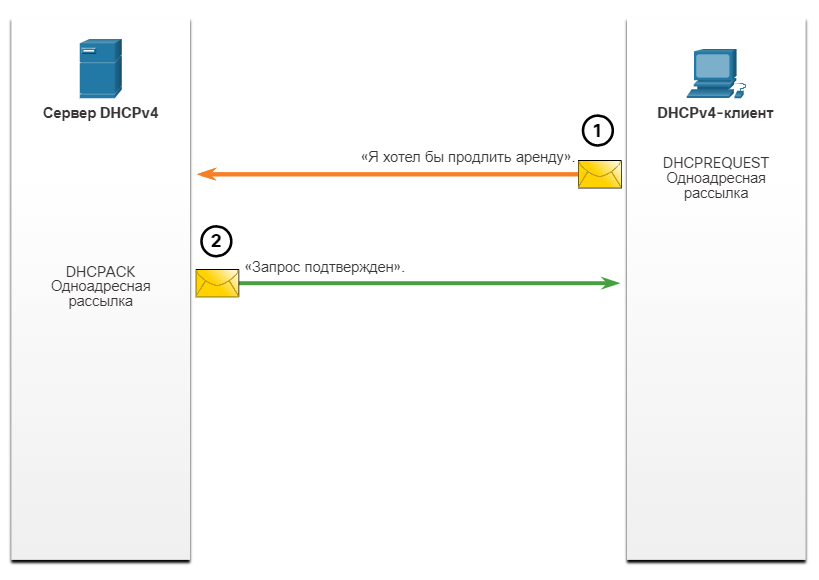

# Принципы DHCPv4

<!-- 7.1.1 -->
## Серверы и клиенты DHCPv4

Протокол динамической конфигурации узла v4 (DHCPv4) динамически назначает адреса IPv4 и другую информацию о конфигурации сети. Поскольку стационарные ПК обычно составляют основную часть сетевых узлов, протокол DHCPv4 является крайне полезным инструментом, позволяющим сетевым администраторам значительно экономить время.

Выделенный DHCPv4-сервер масштабируется и относительно легок в управлении. Однако в небольшом филиале или домашнем офисе (SOHO) маршрутизатор Cisco можно настроить для обеспечения DHCPv4-служб без необходимости в выделенном сервере. ПО Cisco IOS поддерживает дополнительный полнофункциональный сервер DHCPv4.

Сервер DHCPv4 динамически назначает или выдает в аренду IPv4-адрес из пула адресов на ограниченный период времени по выбору сервера или до тех пор, пока у клиента есть необходимость в адресе.

Клиенты арендуют данные у сервера на период, определенный администратором. Администраторы настраивают серверы DHCPv4 таким образом, чтобы срок аренды истекал в разное время. Срок аренды обычно составляет от 24 часов до недели или более. По истечении срока аренды клиент должен запросить другой адрес, хотя в большинстве случаев клиенту повторно назначается тот же адрес.

На рисунке DHCPv4 сервер подключен к коммутатору, подключенному к клиенту DHCPv4; на первом шаге клиент DHCPv4 отправляет сообщение; на втором шаге сервер DHCPv6 отвечает сообщением.

<!-- /courses/srwe-dl/af9ece96-34fe-11eb-b1b2-9b1b0c1f7e0d/afb67549-34fe-11eb-b1b2-9b1b0c1f7e0d/assets/c9f7e470-1c27-11ea-af09-3b2e6521927c.svg -->

1. Процесс аренды DHCPv4 начинается с отправки клиентом сообщения с запросом служб DHCP-сервера.
2. Если есть DHCPv4 сервер, который получает сообщение, он будет отвечать IPv4 адрес и возможные другие сведения о конфигурации сети.

<!-- 7.1.2 -->
## Принципы работы DHCPv4
DHCPv4 работает по модели «клиент-сервер». Когда клиент подключается к серверу DHCPv4, сервер присваивает или сдает ему в аренду IPv4-адрес. Клиент с арендованным IP-адресом подключается к сети до истечения срока аренды. Периодически клиент должен связываться с DHCP-сервером для продления срока аренды. Благодаря подобному механизму «переехавшие» или отключившиеся клиенты не занимают адреса, в которых они больше не нуждаются. По истечении срока аренды сервер DHCP возвращает адрес в пул, из которого адрес может быть повторно получен при необходимости.

<!-- 7.1.3 -->
## Шаги для получения аренды
При начальной загрузке клиента (или ином способе подключения к сети) начинается 4-шаговый процесс получения адреса в аренду.

1. Обнаружение DHCP (DHCPDISCOVER)
2. Предложение DHCP (DHCPOFFER)
3. Запрос DHCP (DHCPREQUEST)
4. Подтверждение DHCP (DHCPACK)

**Шаг 1. DHCP Discover (обнаружение)**
Клиент начинает процесс с сообщения DHCPDISCOVER широковещательной рассылки со своего MAC-адреса с целью обнаружения доступных DHCPv4-серверов. Поскольку во время загрузки у клиента нет верной IPv4-информации, для связи с сервером используются широковещательные адреса уровня 2 и уровня 3. Цель сообщения DHCPDISCOVER - найти серверы DHCPv4 в сети.

На рисунке изображен шаг 1 процесса DHCPv4. Он начинается с широковещательного сообщения DHCPDISCOVER от клиента DHCPv4 на сервер DHCPv4, в котором говорится, что, по сути, я хотел бы запросить адрес.

<!-- /courses/srwe-dl/af9ece96-34fe-11eb-b1b2-9b1b0c1f7e0d/afb67549-34fe-11eb-b1b2-9b1b0c1f7e0d/assets/c9f8ced1-1c27-11ea-af09-3b2e6521927c.svg -->

**Шаг 2. DHCP Offer (предложение)**

Когда сервер DHCPv4 получает сообщение DHCPDISCOVER, он резервирует доступные IPv4-адреса для выдачи в аренду клиенту. Сервер также создает запись ARP, состоящую из MAC-адреса запрашивающего клиента и выданного клиенту IPv4-адреса. DHCPv4-сервер посылает сообщение привязки DHCPOFFER запрашивающему клиенту.

На рисунке изображен шаг 2 процесса DHCPv4 - это одноадресное сообщение DHCPOFFER, отправленное с сервера DHCPv4 клиенту DHCPv4, в котором говорится, что, по сути, я сервер DHCPv4, вот предложение адреса

<!-- /courses/srwe-dl/af9ece96-34fe-11eb-b1b2-9b1b0c1f7e0d/afb67549-34fe-11eb-b1b2-9b1b0c1f7e0d/assets/c9f91cf2-1c27-11ea-af09-3b2e6521927c.svg -->

**Шаг 3. DHCP Request (запрос)**

Когда клиент получает от сервера сообщение DHCPOFFER, он отправляет в ответ сообщение DHCPREQUEST. Это сообщение используется как для первоначальной аренды адреса, так и для ее продления. Когда сообщение используется при первоначальной аренде, DHCPREQUEST служит уведомлением о принятии предложения привязки к предложенным сервером параметрам и косвенным отклонением для всех других серверов, которые могли предоставить клиенту предложение привязки.

В корпоративных сетях часто используется несколько DHCPv4-серверов. Сообщение DHCPREQUEST отправляется в форме широковещательной рассылки с целью информирования данного DHCPv4-сервера и других DHCPv4-серверов о том, что предложение было принято.

На рисунке изображен шаг 3 процесса DHCPv4. Он представляет собой широковещательное сообщение DHCPREQUEST от клиента DHCPv4 на сервер DHCPv4, в котором говорится, что, по сути, я принимаю предложение адреса IPv4

<!-- /courses/srwe-dl/af9ece96-34fe-11eb-b1b2-9b1b0c1f7e0d/afb67549-34fe-11eb-b1b2-9b1b0c1f7e0d/assets/c9f99222-1c27-11ea-af09-3b2e6521927c.svg -->

Шаг 4. Подтверждение DHCP (DHCPACK)

При получении сообщения DHCPREQUEST сервер проверяет информацию об аренде с помощью ping-запроса ICMP на этот адрес, чтобы убедиться, что он еще не используется, создает новую запись ARP для клиентской аренды и отвечает сообщением одноадресной рассылки DHCPACK. Сообщение DHCPACK является копией сообщения DHCPOFFER, за исключением изменения в поле типа сообщения. При получении сообщения DHCPACK клиент загружает информацию о конфигурации и выполняет ARP-проверку присвоенного адреса. Если ARP-ответа нет, значит, IPv4-адрес доступен, и клиент начинает использовать его в качестве собственного адреса.

На рисунке изображен шаг 4 процесса DHCPv4. Он представляет собой одноадресное сообщение DHCPACK, отправленное с сервера DHCPv4 клиенту DHCPv4, в котором говорится, что, по сути, ваше согласие подтверждено

<!-- /courses/srwe-dl/af9ece96-34fe-11eb-b1b2-9b1b0c1f7e0d/afb67549-34fe-11eb-b1b2-9b1b0c1f7e0d/assets/c9fa0752-1c27-11ea-af09-3b2e6521927c.svg -->

<!-- 7.1.4 -->
## Шаги, чтобы возобновить аренду
До истечения срока аренды клиент начинает двухэтапный процесс продления аренды с сервером DHCPv4, как показано на рисунке:

**1. DHCP Request (DHCPREQUEST)**

Перед окончанием аренды клиент отправляет сообщение DHCPREQUEST непосредственно DHCPv4-серверу, который первоначально предложил IPv4-адрес. Если сообщение DHCPACK не получено за определенный период времени, клиент отправляет другое сообщение DHCPREQUEST широковещательной рассылкой, чтобы другой DHCPv4-сервер мог продлить срок аренды.

**2. DHCP Acknowledgment (DHCPACK)**

При получении сообщения DHCPREQUEST сервер подтверждает информацию об аренде ответным сообщением DHCPACK.

**Примечание:** Эти сообщения (в первую очередь DHCPOFFER и DHCPACK) могут отправляться в виде одноадресной рассылки или широковещательной рассылки в соответствии с IETF RFC 2131.

На диаграмме показан двухэтапный процесс и обмен сообщениями между клиентом DHCPv4 и сервером DHCPv4, когда клиент хочет продлить аренду. На первом этапе клиент отправляет одноадресные сообщения DCHPREQUEST на сервер, говоря, что, по сути, я хотел бы продлить срок аренды. На шаге 2 сервер отвечает одноадресным сообщением DHCPACK, в котором говорится, что ваш запрос подтвержден.

<!-- /courses/srwe-dl/af9ece96-34fe-11eb-b1b2-9b1b0c1f7e0d/afb67549-34fe-11eb-b1b2-9b1b0c1f7e0d/assets/c9faa392-1c27-11ea-af09-3b2e6521927c.svg -->

<!-- 7.1.5 Проверьте свое понимание темы - Принципы DHCPv4 -->