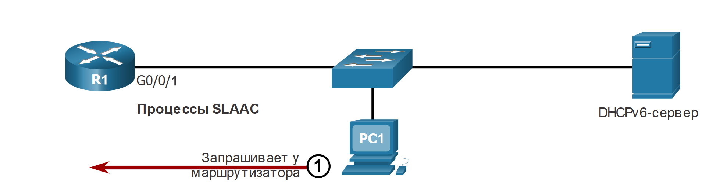
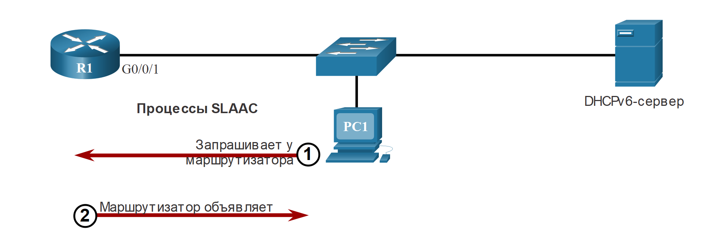
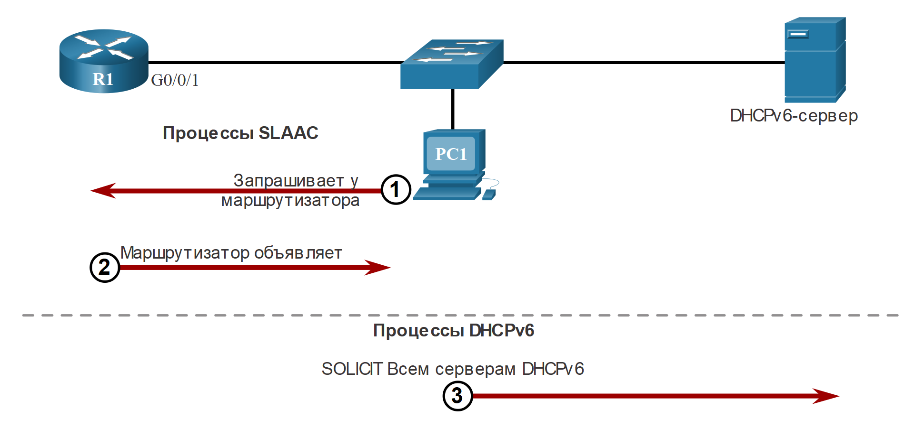
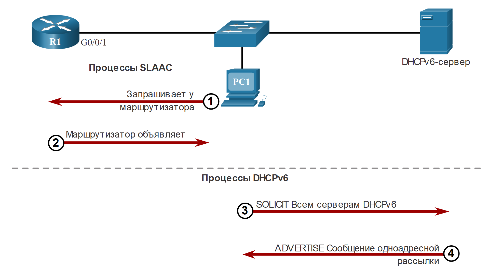
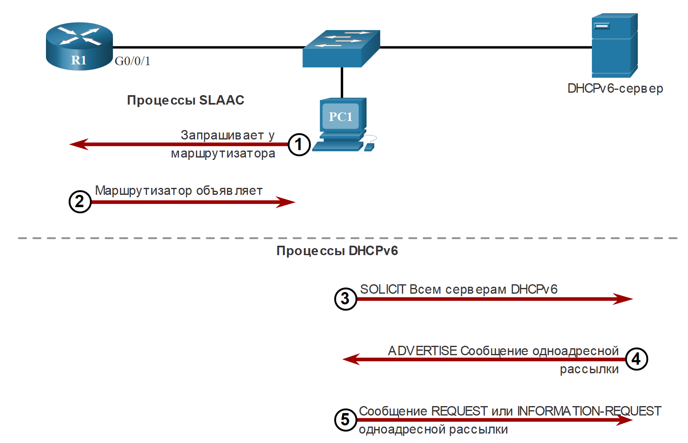
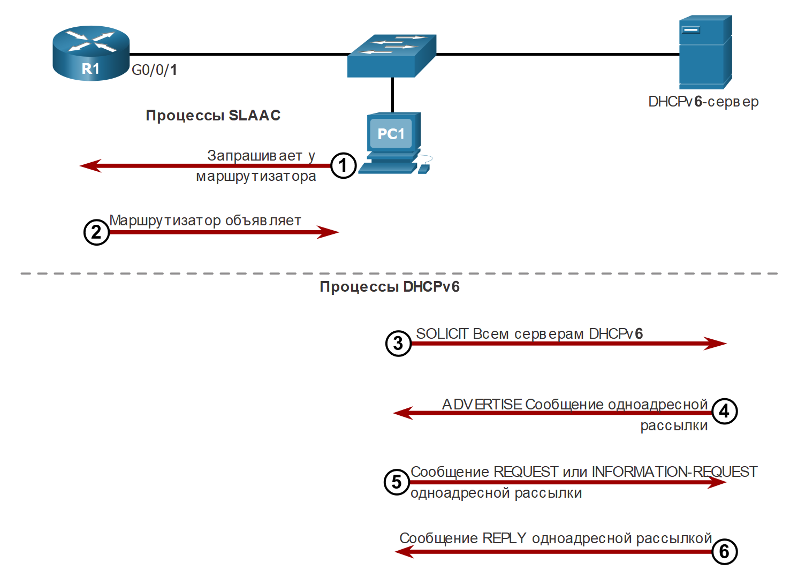

<!-- 8.3.1 -->
## Шаги работы DHCPv6

В этом разделе описывается DHCPv6 без сохранения состояния и с сохранением состояния. DHCPv6 без сохранения состояния использует части SLAAC для обеспечения того, чтобы вся необходимая информация была передана хосту. DHCPv6 с поддержкой состояния состояния не требует SLAAC.

Несмотря на то что протокол DHCPv6 аналогичен DHCPv4 в своих функциональных возможностях, два протокола независимы друг от друга.

Если вариант работы DHCPv6 указан в сообщении RA, устройство начинает обмен данными по схеме клиент-сервер с использованием DHCPv6.

Сообщения DHCPv6 от сервера к клиенту используют UDP-порт назначения 546, а сообщения DHCPv6 от клиента к серверу используют UDP-порт назначения 547.

Шаги работы DHCPv6 заключаются в следующем:

1. Хост отправляет сообщение RS.
2. Маршрутизатор IPv6 отвечает сообщением RA.
3. Хост отправляет сообщение SOLICIT DHCPv6.
4. Сервер DHCPv6 отвечает сообщением DHCPv6 ADVERTISE.
5. Хост отвечает серверу DHCPv6.
6. Сервер DHCPv6 отправляет сообщение REPLY.

**Шаг 1. Хост отправляет сообщение RS.**

PC1 отправляет сообщение RS всем маршрутизаторам с поддержкой IPv6.


<!-- /courses/srwe-dl/af9ece98-34fe-11eb-b1b2-9b1b0c1f7e0d/afb6c362-34fe-11eb-b1b2-9b1b0c1f7e0d/assets/ca1c3551-1c27-11ea-af09-3b2e6521927c.svg -->

**Шаг 2. Маршрутизатор IPv6 отвечает сообщением RA.**

R1 получает RS и отвечает RA, указывая, что клиент должен инициировать связь с сервером DHCPv6.


<!-- /courses/srwe-dl/af9ece98-34fe-11eb-b1b2-9b1b0c1f7e0d/afb6c362-34fe-11eb-b1b2-9b1b0c1f7e0d/assets/ca1c8372-1c27-11ea-af09-3b2e6521927c.svg -->

**Шаг 3. Хост отправляет сообщение SOLICIT DHCPv6.**

Клиент передает сообщение DHCPv6 SOLICIT на зарезервированный IPv6-адрес многоадресной рассылки FF02::1:2, используемый всеми DHCPv6 серверами. Этот адрес многоадресной рассылки действует в рамках канала link-local. Это означает, что маршрутизаторы не направляют сообщения в другие сети.


<!-- /courses/srwe-dl/af9ece98-34fe-11eb-b1b2-9b1b0c1f7e0d/afb6c362-34fe-11eb-b1b2-9b1b0c1f7e0d/assets/ca1cf8a0-1c27-11ea-af09-3b2e6521927c.svg -->

**Шаг 4. Сервер DHCPv6 отвечает сообщением DHCPv6 ADVERTISE.**

Один или несколько серверов DHCPv6 отвечают одноадресным DHCPv6-сообщением ADVERTISE. Сообщение ADVERTISE сообщает DHCPv6-клиенту, что сервер доступен для предоставления службы DHCPv6.


<!-- /courses/srwe-dl/af9ece98-34fe-11eb-b1b2-9b1b0c1f7e0d/afb6c362-34fe-11eb-b1b2-9b1b0c1f7e0d/assets/ca1d46c2-1c27-11ea-af09-3b2e6521927c.svg -->

**Шаг 5. Хост отвечает серверу DHCPv6.**

Ответ PC1 зависит от того, использует ли он DHCPv6 с сохранением состояния или без состояния:

*  **DHCPv6-клиент без сохранения состояния** — клиент создает собственный IPv6-адрес при помощи префикса из сообщения RA и самогенерируемого идентификатора интерфейса. Клиент отправляет DHCPv6 сообщение INFORMATION-REQUEST серверу DHCPv6, запрашивая только параметры конфигурации, например, адрес DNS-сервера.
* **DHCPv6-клиент с отслеживанием состояния** — клиент отправляет DHCPv6 сообщение REQUEST серверу для получения IPv6-адреса и всех остальных параметров конфигурации от сервера.


<!-- /courses/srwe-dl/af9ece98-34fe-11eb-b1b2-9b1b0c1f7e0d/afb6c362-34fe-11eb-b1b2-9b1b0c1f7e0d/assets/ca1dbbf2-1c27-11ea-af09-3b2e6521927c.svg -->

**Шаг 6. Сервер DHCPv6 отправляет сообщение REPLY.**

Сервер отправляет клиенту одноадресные сообщения DHCPv6 REPLY. Содержимое сообщения зависит от того, отвечает ли оно на сообщение REQUEST или INFORMATION-REQUEST.

**Примечание**: Клиент будет использовать исходный IPv6 Link -локальный адрес RA в качестве адреса шлюза по умолчанию . Сервер DHCPv6 не предоставляет эту информацию.


<!-- /courses/srwe-dl/af9ece98-34fe-11eb-b1b2-9b1b0c1f7e0d/afb6c362-34fe-11eb-b1b2-9b1b0c1f7e0d/assets/ca1e3122-1c27-11ea-af09-3b2e6521927c.svg -->

<!-- 8.3.2 -->
## Операция DHCPv6 без сохранения состояния

DHCPv6 без отслеживания состояния сообщает клиенту об использовании информации в сообщении RA для адресации, при этом дополнительные параметры конфигурации доступны с сервера DHCPv6.

Этот процесс известен как протокол DHCPv6 без отслеживания состояния, поскольку сервер не поддерживает никакую информацию о состоянии клиента, то есть список доступных и распределенных IPv6-адресов. DHCPv6-серверы без отслеживания состояния предоставляют только параметры конфигурации для клиента, но не выделяют IPv6-адреса.

На рисунке показана операция DHCPv6 без учета состояния.


<!-- /courses/srwe-dl/af9ece98-34fe-11eb-b1b2-9b1b0c1f7e0d/afb6c362-34fe-11eb-b1b2-9b1b0c1f7e0d/assets/ca1ef470-1c27-11ea-af09-3b2e6521927c.svg -->

1. PC1 получает сообщение DHCP RA без состояния. Сообщение RA содержит префикс сети и длину префикса. Флаг M для DHCP с сохранением состояния имеет значение по умолчанию 0. Флаг A=1 указывает клиенту использовать SLAAC. Значение флага O, равное 1, используется для информирования клиента о том, что на DHCPv6-сервере без отслеживания состояния доступна дополнительная информация о конфигурации.
2. Клиент отправляет сообщение DHCPv6 SOLICIT в поисках сервера DHCPv6 без состояния для получения дополнительной информации (например, адреса DNS-серверов).

<!-- 8.3.3 -->
## Включение протокола DHCPv6 без состояния на интерфейсе

DHCPv6 без состояния включен на интерфейсе маршрутизатора с помощью команды конфигурации интерфейса **ipv6 nd other-config-flag**. Это устанавливает флаг O в 1.

Выделенные выходные данные подтверждают, что RA сообщит принимающим хостам использовать автоматическую настройку без состояния (флаг A = 1) и свяжется с сервером DHCPv6 для получения другой информации о конфигурации (флаг O = 1).

**Примечание:** Вы можете использовать **no ipv6 nd other-config-flag** для сброса интерфейса к опции SLAAC по умолчанию (флаг O = 0).

```
R1(config-if)# ipv6 nd other-config-flag
R1(config-if)# end
R1#
R1# show ipv6 interface g0/0/1 | begin ND
  ND DAD is enabled, number of DAD attempts: 1
  ND reachable time is 30000 milliseconds (using 30000)
  ND advertised reachable time is 0 (unspecified)
  ND advertised retransmit interval is 0 (unspecified)
  ND router advertisements are sent every 200 seconds
  ND router advertisements live for 1800 seconds
  ND advertised default router preference is Medium
  Hosts use stateless autoconfig for addresses.
  Hosts use DHCP to obtain other configuration.
R1#
```

<!-- 8.3.4 -->
## Работа DHCPv6 с отслеживанием состояния

Данный вариант наиболее схож с использованием с протокола DHCPv4. В этом случае сообщение RA сообщает клиенту получить всю информацию об адресации с сервера DHCPv6 с сохранением состояния, за исключением адреса шлюза по умолчанию, который является исходным IPv6 локальным адресом RRA.

DHCPv6 с отслеживанием состояния получил такое название потому, что сервер DHCPv6 поддерживает информацию о состоянии протокола IPv6. Работа сервера аналогична работе сервера DHCPv4, распределяющего IPv4-адреса.

На рисунке показана операция DHCPv6 с сохранением состояния.


<!-- /courses/srwe-dl/af9ece98-34fe-11eb-b1b2-9b1b0c1f7e0d/afb6c362-34fe-11eb-b1b2-9b1b0c1f7e0d/assets/ca1fb7c2-1c27-11ea-af09-3b2e6521927c.svg -->

1. PC1 получает сообщение DHCPv6 RA с флагом O равным 0 и флагом M равным 1, указывая PC1, что он получит всю информацию об адресации IPv6 от сервера DHCPv6 с сохранением состояния.
2. PC1 отправляет сообщение SOLICIT DHCPv6 в поисках сервера DHCPv6 с сохранением состояния.

**Примечание**: Если A=1 и M=1, некоторые операционные системы, такие как Windows, создадут адрес IPv6 с помощью SLAAC и получат другой адрес от сервера DHCPv6 с сохранением состояния. В большинстве случаев рекомендуется вручную установить флаг A равным 0.

<!-- 8.3.5 -->
## Включить DHCPv6 с поддержкой состояния на интерфейсе

Протокол DHCPv6 с протоколом состояния включен на интерфейсе маршрутизатора с помощью команды конфигурации интерфейса **ipv6 nd managed-config-flag**. Это устанавливает флаг M в 1.

Выделенные выходные данные в примере подтверждают, что RA сообщит хосту, чтобы получить всю информацию о конфигурации IPv6 с сервера DHCPv6 (флаг M = 1).

```
R1(config)# int g0/0/1
R1(config-if)# ipv6 nd managed-config-flag
R1(config-if)# ipv6 nd prefix default no-autoconfig
R1(config-if)# end
R1#
R1# show ipv6 interface g0/0/1 | begin ND
  ND DAD is enabled, number of DAD attempts: 1
  ND reachable time is 30000 milliseconds (using 30000)
  ND advertised reachable time is 0 (unspecified)
  ND advertised retransmit interval is 0 (unspecified)
  ND router advertisements are sent every 200 seconds
  ND router advertisements live for 1800 seconds
  ND advertised default router preference is Medium
  Hosts use DHCP to obtain routable addresses.
R1#
```

<!-- 8.3.6 -->
<!-- quiz -->